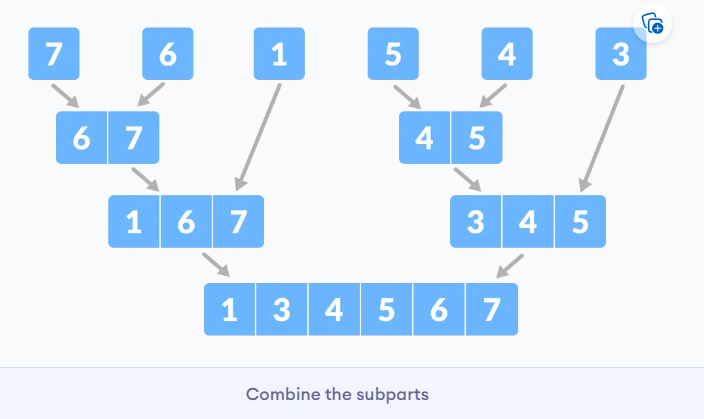

视频简介：https://www.youtube.com/playlist?list=PLkZYeFmDuaN2-KUIv-mvbjfKszIGJ4FaY
视频教程：https://www.bilibili.com/video/BV1UP4y1W7hX
java版本：github.com/williamfiset/data-structures
Python版本：https://github.com/akzare/Algorithms


programiz网站教程：https://www.programiz.com/dsa
programiz网站教程（中文，好像是机翻）：https://miz.apachecn.org/#/docs/dsal/3

# 1.DSA简介
## 1.1 什么是DSA，为什么学习？
数据结构是用于存储和组织数据，算法是解决特定问题的步骤集合。学习数据结构和算法使我们能够编写高效和优化的计算机程序。
>注：数据结构和算法DataStructure & Algorithms（DSA），后面简称DSA

(Abstract Data Types, ADT) vs. Data Structures
ADT是数据结构的抽象，只描述数据结构应该提供哪些接口，而不涉及具体实现。 DS则是具体实现。
例如，List是ADT，具体的实现可以用动态数组或链表实现。


为什么学习DSA？
从程序角度，学好数据结构和算法才能更有效的完成任务。例如排序，如果没有学过DSA，大概只能写出`O(N^2)`的算法，学过算法后，就会知道`O(NlogN)`的算法。
从现实角度，数据结构和算法是公司招聘时考察的重要部分。

### 相关的书籍
- Introduction to Algorithms（算法导论）, Thomas H. Cormen - it is one of the best books in algorithms and covers a broad range of algorithms in-depth
- Algorithms（算法）, Robert Sedgewick - it is the leading textbook on algorithms and is widely used in colleges and universities
- The Art of Computer Programming（计算机编程的艺术）, Donald E. Knuth - this book is considered best if you know the subject and are looking for deeper understanding

## 1.2 数据结构和类型
数据结构用来存储和组织数据。
基本上，数据结构可以分为两类：
- 线性数据结构
- 非线性数据结构

### 线性数据结构
线性数据结构中，元素是一个接着一个的有序序列。常见的线性数据结构有：
1. Array（数组）
数组在内存的存储是连续的。数组中的元素是同一类型的。
2. Stack （栈）
栈是一种后进先出(last in first out, LIFO)的数据结构。
3. Queue（队列）
队列是一种先进先出(FIFO)的数据结构。
4. Linked List（链表）
链表中的元素是一串节点(nodes)，每个节点保存数据和下一个节点的地址。

### 非线性数据结构
非线性数据结构没有特定的顺序。只是定义了元素间的连接关系。
1. Graph（图）
图中的每个节点称为顶点(vertex),顶点间通过边(edge)连接。
2. Tree（树）
树是一种特殊的图（无环图）


## 1.3 渐进(asymptotic)分析 大O符号
大O表示法表示算法运行时间的上限。 因此，它给出了算法的最坏情况的复杂度。大O表示法是最常用的。
例如，查找长度为`N`的数组中值为`99`的元素的位置，最坏情况（元素在数组的最后或者元素不存在），要执行`N`次判断操作，则查找时间复杂度为`O(N)`。

常见的时间复杂的有：
- 常数 O(1)
- 对数 O(log(n))
- 线性 O(n)
- Linearithmic O(nlog(n))
- 平方 O(n^2)

O表示法通常只关注级别，有以下属性：
O(n+c) = O(n)
O(cn) = O(n), c>0

例如，f(n) 15n^2 + 2n^3 + 8， 则O(f(n)) = O(n^3)
下面是一些具体的例子
常数复杂度O(1)：
```py
a = 1
b = 2
c = a + b
```
线性复杂度O(n)：
```py
i = 0
while i < n:
    i = i + 1
```
平方复杂度O(n^2)
```py
for i in range(n):
    for j in range(n):
        ...
```


Theta(Θ)表示法从上方和下方将函数括起来，代表算法运行时间的上限和下限。
Ω表示算法运行时间的下限。


## 1.4 主定理和分治算法(略)
### 主定理
主定理是用来计算递推关系`T(n) = aT(n/b) + f(n),`的时间复杂度。
如果a ≥ 1和b > 1是常数，并且f(n)是渐近正函数，则递归关系的时间复杂度由下式给出：
$$
T(n) = aT(n/b) + f(n)
$$
其中, $T(n)$ 有下列渐进边界:


主定理的求解示例
$T(n) = 3T(n/2) + n^2$


主定理的局限性
在以下情况下，不能使用主定理：

- T(n)不是单调的。 例如。T(n) = sin n
- f(n)不是多项式。 例如。f(n) = 2^n
- a不是常数。 例如。a = 2n
- a < 1

https://zhuanlan.zhihu.com/p/113406812

### 分治算法(Divide and Conquer)（略）
分治即分而治之，分治算法解决问题的步骤为：
1. 将问题分解成更小的子问题
2. 解决子问题（这个过程可以继续分解，直到子问题可以直接解决）
3. 合并子问题的解

下面是使用分治算法解决排序的例子。（归并排序 merge sort)





可用主定理分析时间复杂度


**Divide and Conquer Vs Dynamic approach（动态规划）**

分治的方法将问题分为较小的子问题，这些子问题可以递归进一步解决。 每个子问题的结果都不存储以供将来参考，而在动态方法中，每个子问题的结果均存储以供将来参考。

当同一子问题无法多次解决时，请使用分治的方法。 当将来要多次使用子问题的结果时，请使用动态方法。

让我们通过一个例子来理解这一点。 假设我们试图找到斐波那契数列。 
分治：
```py
fib(n)
    If n < 2, return 1
    Else , return f(n - 1) + f(n -2)
```
动态规划：
```py
mem = [ ]
fib(n)
    If n in mem: return mem[n] 
    else,     
        If n < 2, f = 1
        else , f = f(n - 1) + f(n -2)
        mem[n] = f
        return f
```


# List
## static Array?
static Array（静态数组）是固定长度的容器，内部元素可以索引，索引范围是[0, n-1]。
可索引(indexable)意味着每个元素可以通过一个数字访问。

static array 在内存中是连续存储的，因此static array的地址是连续的。

static array的用处：
- 存储和访问序列数据
- 暂时存储对象
- IO buffer


注意，索引从0开始。

## Dynamic Array
Dynamic Array(动态数组)长度可变。

如何通过静态数组实现动态数组？
给静态数组一个初始长度，（添加元素时）当存储的元素数量超出数组长度时，分配一个长度翻倍的数组，将原来数组的元素复制过来。

>Python没有静态数组，只有动态数组。Python提供了一个array标准库，提供固定数据类型的动态数组。


## Singly and Doubly Linked Lists
A linked list is a sequential list of nodes that hold data which point to other nodes also containing data.
链表由一系列节点组成，每个节点都存储数据和指向下一个节点的指针。

链表用处
-  List, Queue & Stack 的实现
- 创建circular lists
- 对循环事物建模

链表相关术语
  

双向链表的每个节点有两个指针，分别指向下一个节点和上一个节点。这样就可以方便地访问前一个节点，给一些操作（如删除）带来遍历。但存储的指针翻倍，更占内存。

**插入 Insert**
视频 40:44
**删除 Remove**
视频 43:43


#  Stack

栈中元素后进先出。我们把添加元素称为`push`，取出元素称为`pop`.

### 栈的操作
栈是一个允许执行以下操作的抽象数据结构（ADT）：

`Push`：将元素添加到栈顶部
`Pop`：从栈顶部删除元素
`IsEmpty`：检查栈是否为空
`IsFull`：检查栈是否已满
`Peek`：获取顶部元素的值而不删除它


### 栈的实现
使用指针TOP用于跟踪栈中的顶部元素。
初始化栈时，将其值设置为`-1`，以便通过比较`TOP == -1`来检查栈是否为空。
推入元素时，增加TOP的值，然后将新元素放置在TOP指向的位置。
弹出元素时，返回TOP指向的元素并减小其值。
推入之前，检查栈是否已满
弹出之前，检查栈是否已为空

Python实现
>网站上的Python实现有点太简单了，并没有使用数组，而是利用了list的一些功能（append、pop、len)。如果这样，list本身就可以当做stack和queue使用。
>但是貌似也没什么问题，LeetCode等刷题网站也是可以这样做的。所以后面提供
>简单方法 和 不使用list功能的2个版本。

网站版本(https://www.programiz.com/dsa/stack)
下面是自己用类写的版本：
```py
# Stack
class Stack:
    def __init__(self, size):
        self.size = size
        self.stack = []

    def push(self, ele):
        self.stack.append(ele)

    def pop(self):
        if self.is_empty():
            print("stack is empty")
            return None
        return self.stack.pop()

    def is_empty(self):
        return len(self.stack) == 0

    def is_full(self):
        return len(self.stack) == self.size

    def __str__(self):
        return str(self.stack)


if __name__ == '__main__':
    stack = Stack(10)
    for i in range(4):
        stack.push(str(i))
    print("stack  " + str(stack))
    print("popped item: " + stack.pop())
    print("stack after popping an element: " + str(stack))
```

不使用list特性的实现(参考java）：
```py
# Stack
class Stack2:
    def __init__(self, size):
        self.size = size
        self.stack = [None]* size
        self.top = -1

    def push(self, ele):
        if self.is_full():
            print("stack is full, cancel push")
            return
        self.top += 1
        self.stack[self.top] = ele

    def pop(self):
        if self.is_empty():
            print("stack is empty")
            return None
        res = self.stack[self.top]
        self.top -= 1
        return res

    def is_empty(self):
        return self.top == -1

    def is_full(self):
        return self.top == self.size -1

    def __str__(self):
        return str(self.stack[:self.top+1]) if self.top != -1 else str([])


if __name__ == '__main__':
    stack = Stack2(10)
    for i in range(11):
        stack.push(str(i))
    print("stack  " + str(stack))
    print("popped item: " + stack.pop())
    print("stack after popping an element: " + str(stack))
```
**测试**：https://leetcode.cn/problems/implement-stack-using-queues/
**栈的时间复杂度**
对于基于数组的栈实现，推入和弹出操作需要固定时间，即`O(1)`，因为在两种情况下都只有指针移动。

**栈的应用**
尽管栈是一个易于实现的简单数据结构，但它非常强大。 栈最常见的用途是：

- **反转**单词: 将所有字母叠放并弹出。 由于栈的 LIFO 顺序，您将获得相反顺序的字母。
- 在编译器中: 编译器使用栈通过将表达式转换为前缀或后缀形式来计算2 + 4 / 5 * (7 - 9)之类的表达式的值。
- 在浏览器中: 浏览器中的“后退”按钮会将您以前访问过的所有 URL 保存在栈中。 每次您访问新页面时，它都会被添加到栈顶部。 当您按下“后退”按钮时，当前 URL 从栈中删除，并访问前一个 URL
  

## 2.2 Queue

队列元素先进先出。我们将放入元素称为`enqueue`，取出元素称为`dequeue`。

**队列的操作**：
- Enqueue: 在队列末尾添加元素
- Dequeue:在队列开头移除元素
- IsEmpty: Check if the queue is empty
- IsFull: Check if the queue is full
- Peek: 获取队列开头元素但不移除

**队列的实现**
（这个实现是基于不可变数组的，在Python中实现比较简单，不需要指针概念）
使用两个指针`FRONT`和`REAR`分布追踪队列开头和结尾元素。指针初始值为`-1`。
Enqueue：
- 检查队列是否已满。
- 如果是第一个元素，设置`FRONT`为0。
- `REAR`索引加1,将新元素放到`REAR`所指的位置。
Dequeue：
- 检查队列是否为空。
- 返回`FRONT`所指元素。
- `FRONT` 加1
- 如果是最后一个元素，设置`FRONT`和`REAR`为-1。


Queue的Python实现
```py
# Queue implementation in Python

class Queue:

    def __init__(self):
        self.queue = []

    # Add an element
    def enqueue(self, item):
        self.queue.append(item)

    # Remove an element
    def dequeue(self):
        if len(self.queue) < 1:
            return None
        return self.queue.pop(0)

    # Display  the queue
    def display(self):
        print(self.queue)

    def size(self):
        return len(self.queue)


q = Queue()
q.enqueue(1)
q.enqueue(2)
q.enqueue(3)
q.enqueue(4)
q.enqueue(5)

q.display()

q.dequeue()

print("After removing an element")
q.display()
```
注意，由于利用了list的方法，所以没有实现isfull(), isempty()等。

版本二（不利用list方法）
```py
# Queue implementation in Python

class Queue:

    def __init__(self,size):
        self.queue = [None]*size
        self.size = size
        self.front = -1 
        self.rear = -1 

    def is_full(self):
        return  self.front == 0 and self.rear == self.size -1

    def is_empty(self):
        return  self.front == -1

    # Add an element
    def enqueue(self, item):
        if self.is_full():
            print("queue is full, cancel enqueue")
            return None
        if self.front == -1:
            self.front = 0
        self.rear += 1
        self.queue[self.rear] = item

    # Remove an element
    def dequeue(self):
        if self.is_empty():
            print("queue is empty, cancel dequeue")
            return None
        res = self.queue[self.front]

        if self.front == self.rear:
            self.front = self.rear = -1
        else:
            self.front += 1
        return res


    # Display  the queue
    def __str__(self):
        return str(self.queue[self.front:self.rear+1])


q = Queue(10)
for i in range(1,12):
    q.enqueue(i)


print(q)
q.dequeue()
print("After removing an element")
print(q)
```


**缺陷**

可以发现，经过若干入队，出队操作后，指针向右移动，而左面的空间无法使用（除非队列清空了，指针重置）。这个问题可以通过循环队列解决。

**复杂度**
使用数组的队列中入队和出队操作的复杂度为O(1)。

**队列应用**
- CPU 调度，磁盘调度
- 在两个进程之间异步传输数据时，使用队列进行同步。 例如：IO 缓冲区，管道，文件 IO 等
- 实时系统中的中断处理。
- 呼叫中心电话系统使用队列来保持人们按顺序呼叫他们

## 2.3 Types of Queue
有4种不同的队列：
- Simple Queue
- Circular Queue
- Priority Queue
- Double Ended Queue


**简单队列**， 遵循先进先出规则。


**循环队列**，最后一个元素指向第一个元素


**优先级队列**，插入时根据值的到达发生，而删除根据优先级发生


**双端队列**，两头都可以插入或删除，它不遵循先进先出。


## 2.4 Circular Queue
循环队列是普通队列的一个扩展，它将最后元素和第一个元素连接起来，构成循环。解决了普通队列的空间浪费的问题。


**如何实现循环？**
通过指针的**循环加**实现，也就是说，如果指针到达队列的末尾，就会从头开始(通过取余实现)。
`if REAR + 1 == 8 (overflow!), REAR = (REAR + 1)%8 = 0 (start of queue)`

**循环队列的操作**
首先，它满足普通队列的操作。
使用两个指针`FRONT`和`REAR`分布追踪队列开头和结尾元素。指针初始值为`-1`。
Enqueue：
- 检查是否已满
- 如果是第一个元素，`FRONT`设为0.
- 循环加`REAR`索引
- 将新元素放到`REAR`位置

Dequeue：
- 检查是否为空
- 返回`FRONT`位置元素
- 循环加`FRONT`
- 如果是最后一个元素，重置`FRONT`和`REAR`为-1

然而，检查队列满需要考虑新的情况：
- case 1: FRONT == 0 && REAR == SIZE - 1
- case 2: FRONT == REAR + 1

这两种情况可以合并为：
`(REAR+1)% SIZE == FRONT`
第二种情况发生在REAR由于循环加而从 0 开始且其值仅比FRONT小 1 时，队列已满。


**循环队列的Python实现**
```py
class MyCircularQueue:
    def __init__(self, size):
        self.size = size
        self.queue = [None] * size
        self.head = self.tail = -1

    def is_empty(self):
        return self.head == -1

    def is_full(self):
        return (self.tail + 1) % self.size == self.head

    # Insert an element into the circular queue
    def enqueue(self, data):
        if self.is_full():
            print("The circular queue is full\n")
            return None
        if self.head == -1:
            self.head = 0
        self.tail = (self.tail + 1) % self.size
        self.queue[self.tail] = data

    # Delete an element from the circular queue
    def dequeue(self):
        if self.is_empty():
            print("The circular queue is empty\n")
            return None

        temp = self.queue[self.head]
        if self.head == self.tail:
            self.head = -1
            self.tail = -1
        else:
            self.head = (self.head + 1) % self.size
        return temp

    def __str__(self):
        if self.head == -1:
            return "No element in the circular queue"
        elif self.tail >= self.head:
            return str(self.queue[self.head: self.tail + 1])
        else:
            return str(self.queue[self.head: self.size] + self.queue[:self.tail + 1])
```

**测试：**
https://leetcode.cn/problems/design-circular-queue/
注：需要根据题目要求做一些修改。
**时间复杂度**
出队入队为O(1)
**循环队列应用**
- CPU 调度
- 内存管理
- 交通管理

### 循环队列要点小结
1. 通过循环加(`rear = (rear + 1)%size`) 实现循环
2. 通过front == -1 判断空
3. 通过(rear + 1)%size == front 判断满
4. 判断入队和出队时的特殊情况：队列变空/非空


## 2.5 Priority Queue
优先级队列出队顺序和元素的优先级相关，而不是先进先出。
通常使用二叉堆(heap)实现优先队列。下面用最大堆（父>子）实现。
（这个实际上主要讲了堆操作，如何实现可以等到看到堆的时候再回头看）
优先级队列的**插入元素**：
1.将元素**插入树的底部**

2.Heapify


**删除元素**
1.选择要删除的元素(3)

2.与树的底部元素交换

3.删除元素

4.Heapify


**Peek**
返回根节点
**提取最大/小值**
从最大堆中删除节点后，Extract-Max返回具有最大值的节点，而从最小堆中删除节点后，Extract-Min返回具有最小值的节点。

优先队列Python实现
```py
# Priority Queue implementation in Python


# Function to heapify the tree
def heapify(arr, n, i):
    # Find the largest among root, left child and right child
    largest = i
    l = 2 * i + 1
    r = 2 * i + 2

    if l < n and arr[i] < arr[l]:
        largest = l

    if r < n and arr[largest] < arr[r]:
        largest = r

    # Swap and continue heapifying if root is not largest
    if largest != i:
        arr[i], arr[largest] = arr[largest], arr[i]
        heapify(arr, n, largest)


# Function to insert an element into the tree
def insert(array, newNum):
    size = len(array)
    if size == 0:
        array.append(newNum)
    else:
        array.append(newNum)
        for i in range((size // 2) - 1, -1, -1):
            heapify(array, size, i)


# Function to delete an element from the tree
def deleteNode(array, num):
    size = len(array)
    i = 0
    for i in range(0, size):
        if num == array[i]:
            break

    array[i], array[size - 1] = array[size - 1], array[i]

    array.remove(size - 1)

    for i in range((len(array) // 2) - 1, -1, -1):
        heapify(array, len(array), i)


arr = []

insert(arr, 3)
insert(arr, 4)
insert(arr, 9)
insert(arr, 5)
insert(arr, 2)

print ("Max-Heap array: " + str(arr))

deleteNode(arr, 4)
print("After deleting an element: " + str(arr))
```
Python的库实现：https://docs.python.org/zh-cn/3/library/queue.html?highlight=queue#queue.PriorityQueue

**优先队列应用**
- Dijkstra 算法
- 用于实现栈
- 用于操作系统中的负载平衡和中断处理
- 用于霍夫曼代码中的数据压缩


## 2.6 Deque
(这个部分programiz.com上感觉有点问题，建议直接看LeetCode上的循环双端队列题解)
双端队列是队列的一种，其中元素的插入和删除可以从前面或后面进行。 因此，它不遵循 FIFO 规则（先进先出）。
### 双端循环队列小结
- 使用front和rear指针指向队列头和尾。初始化front = -1, rear = -1
- 判空用front == -1。 判满有2种情况：1. front在最左，rear在最右；2.  front在rear右一格： `front == 0 and rear == n - 1 OR front == rear + 1`
- 插入前都要判满，删除前都要判空
- 插入时考虑特殊情况，队列为空时，插入一个元素将导致`front=rear=0`。
- 使用循环-和循环+ 左右移动指针。例如插入时：front和rear:`self.front = (self.front-1) % self.size` 、`self.rear = (self.rear+1)%self.size` 插入时front向左，删除时front向右。
- 删除时考虑只有一个元素时，删除将清空队列。
下面是用循环数组实现的双端队列
操作：
**初始化**
**在前面插入**
**在尾部插入**
**从前面删除** 
**从后面删除**
**Check Empty**
If front == -1, the deque is empty.
**Check Full**
If front == 0 and rear == n - 1 OR front == rear + 1, the deque is full.

Python实现Dequeue(简单版)
```py
# Deque implementaion in python

class Deque:
    def __init__(self):
        self.items = []

    def isEmpty(self):
        return self.items == []

    def addRear(self, item):
        self.items.append(item)

    def addFront(self, item):
        self.items.insert(0, item)

    def removeFront(self):
        return self.items.pop(0)

    def removeRear(self):
        return self.items.pop()

    def size(self):
        return len(self.items)


d = Deque()
print(d.isEmpty())
d.addRear(8)
d.addRear(5)
d.addFront(7)
d.addFront(10)
print(d.size())
print(d.isEmpty())
d.addRear(11)
print(d.removeRear())
print(d.removeFront())
d.addFront(55)
d.addRear(45)
print(d.items)
```

数组实现双端循环队列Dequeue：
```py
class MyCircularDeque:
    def __init__(self, size):
        self.size = size
        self.items = [-1] * size
        self.front = -1
        self.rear = -1

    def isFull(self):
        return (self.front == 0 and self.rear == self.size - 1) or (self.front == self.rear + 1)

    def isEmpty(self):
        return self.front == -1

    def insertFront(self, item):
        if self.isFull():
            return False
        if self.isEmpty():
            self.front = self.rear = 0
        else:
            self.front = (self.front-1) % self.size
        self.items[self.front] = item
        return True

    def insertLast(self, item):
        if self.isFull():
            return False
        if self.isEmpty():
            self.front = self.rear = 0
        else:
            self.rear = (self.rear+1)%self.size
        self.items[self.rear] = item
        return True

    def deleteFront(self):
        if self.isEmpty():
            return False
        if self.front == self.rear:
            self.front = self.rear = -1
        else:
            self.front = (self.front+1)% self.size
        return True

    def  deleteLast(self):
        if self.isEmpty():
            return False
        if self.front == self.rear:
            self.front = self.rear = -1
        else:
            self.rear = (self.rear-1)%self.size
        return True

    def getFront(self):
        if self.isEmpty():
            return -1
        return self.items[self.front]

    def getRear(self):
        if self.isEmpty() or self.rear < 0:
            return -1
        return self.items[self.rear]

```

**应用**
- 软件中的撤销操作(undo)
- 浏览器历史记录
- 实现stack和queue。

