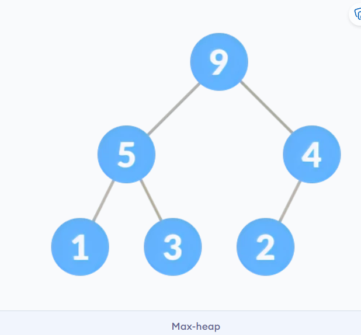

find  -type f -size +100M | xargs rm 
# 链表 Linked List
**链表**是一种线性数据结构，由一系列连接在一起的节点(node)组成。每个节点有两部分，数据和下一个节点的地址。


链表需要有个头，一般称为`HEAD`，并且尾巴一般是`None`。
链表根据链接的方式，可以分成 单链表、双链表和循环链表。


下面我们看看如何用Python实现单链表：
```py
# Linked list implementation in Python
class Node:
    # Creating a node
    def __init__(self, item):
        self.item = item
        self.next = None


class LinkedList:

    def __init__(self):
        self.head = None


if __name__ == '__main__':

    linked_list = LinkedList()

    # Assign item values
    linked_list.head = Node(1)
    second = Node(2)
    third = Node(3)

    # Connect nodes
    linked_list.head.next = second
    second.next = third

    # Print the linked list item
    while linked_list.head != None:
        print(linked_list.head.item, end=" ")
        linked_list.head = linked_list.head.next
```

**链表应用**
- 动态内存分配
- 实现stack 和 queue
- 实现撤销功能（undo）
- 哈希表、图

# 链表操作
链表的基本操作如下：
- Traveral: 遍历链表中的每个元素
- Insertion：插入新元素
- Deletion：删除元素
- Search：查询元素
- Sort：排序

## 遍历
遍历链表很简单，需要获得`HEAD`，然后使用 `next` 找到下一个节点，直到下一个节点是`None`代表到达链表末尾。
```py
while linked_list.head != None:
    print(linked_list.head.item, end=" ")
    linked_list.head = linked_list.head.next
```
## 插入
插入时始终时先建立连接，在断开连接。
在开头插入：
在开头插入需要处理和`HEAD`节点和`HEAD.next`节点的连接。
```py
newNode.next = head
head = newNode
```
在尾部插入：将最后节点的next指向该节点，然后将该节点的next设置为None。
```py
tmp = head;
while tmp.next != None:
    tmp = tmp.next
tmp.next = newNode
```

在中间插入，先找到插入位置temp，然后
```py
tmp = head
for i in range(xx):
    if tmp.next != None:
        tmp = tmp.next

newNode.next = temp.next
temp.next = newNode
```
## 删除（略）
## 搜索（略）
## 排序
考虑使用冒泡排序。 链表和普通数组的区别是交换元素时，只需要交换节点的data。

## Pytho实现链表操作
```py
# Create a node
class Node:
    def __init__(self, data):
        self.data = data
        self.next = None


class LinkedList:

    def __init__(self):
        self.head = None

    # Insert at the beginning
    def insertAtBeginning(self, new_data):
        new_node = Node(new_data)

        new_node.next = self.head
        self.head = new_node

    # Insert after a node
    def insertAfter(self, prev_node, new_data):

        if prev_node is None:
            print("The given previous node must inLinkedList.")
            return

        new_node = Node(new_data)
        new_node.next = prev_node.next
        prev_node.next = new_node

    # Insert at the end
    def insertAtEnd(self, new_data):
        new_node = Node(new_data)

        if self.head is None:
            self.head = new_node
            return

        last = self.head
        while (last.next):
            last = last.next

        last.next = new_node

    # Deleting a node
    def deleteNode(self, position):

        if self.head is None:
            return

        temp = self.head

        if position == 0:
            self.head = temp.next
            temp = None
            return

        # Find the key to be deleted
        for i in range(position - 1):
            temp = temp.next
            if temp is None:
                break

        # If the key is not present
        if temp is None:
            return

        if temp.next is None:
            return

        next = temp.next.next

        temp.next = None

        temp.next = next

    # Search an element
    def search(self, key):

        current = self.head

        while current is not None:
            if current.data == key:
                return True

            current = current.next

        return False

    # Sort the linked list
    def sortLinkedList(self, head):
        current = head
        index = Node(None)

        if head is None:
            return
        else:
            while current is not None:
                # index points to the node next to current
                index = current.next

                while index is not None:
                    if current.data > index.data:
                        current.data, index.data = index.data, current.data

                    index = index.next
                current = current.next

    # Print the linked list
    def printList(self):
        temp = self.head
        while (temp):
            print(str(temp.data) + " ", end="")
            temp = temp.next


if __name__ == '__main__':

    llist = LinkedList()
    llist.insertAtEnd(1)
    llist.insertAtBeginning(2)
    llist.insertAtBeginning(3)
    llist.insertAtEnd(4)
    llist.insertAfter(llist.head.next, 5)

    print('linked list:')
    llist.printList()

    print("\nAfter deleting an element:")
    llist.deleteNode(3)
    llist.printList()

    print()
    item_to_find = 3
    if llist.search(item_to_find):
        print(str(item_to_find) + " is found")
    else:
        print(str(item_to_find) + " is not found")

    llist.sortLinkedList(llist.head)
    print("Sorted List: ")
    llist.printList()
```

# 链表类型-单链表、双链表和循环链表


双链表在单链表的基础上加了`prev`指针，指向节点的前节点
https://www.programiz.com/dsa/doubly-linked-list

循环链表在单链表的基础上将链表尾部和头部相连。
https://www.programiz.com/dsa/circular-linked-list


# 哈希表 Hash Table
>注：这里网站写的比较简单，建议对照《算法导论》（第三版）学习。


哈希表以键-值(Key-value)的形式存储数据
Key是索引，Value则是数据。

Python中的字典就是哈希表。
## 直接寻址表
如果key很少的话，可以用直接寻址。可以用一个数组，或称为直接寻址表，记作T[0..m-1]。其中每个位置，或称为槽，对应key域的一个key。

容易实现字典操作：
```
DIRECT-ADDRESS-SEARCHCT,k) 
return T[k]
DIRECT-ADDRESS-INSERT(T,x) 
T[x.,key]=x 
DIRECT-ADDRESS-DELETE(T,x) 
T[x. key]=NIL 
```

## 哈希
key通常并不直接作为数组索引，需要进行一个映射。
哈希是将key映射成索引的过程:
`index = h(key)`  

因此，知道了key，就可以直接获得索引，而无需遍历查找。
通过key获得value的效率是`O(1)`。（一般情况下）

## 哈希冲突
对于不同的key,哈希函数映射到同一个索引，则发生冲突。

## chaining 链接法
我们可以通过双链表解决哈希冲突。此时槽中存储的是一个双链表。 

解决冲突后，容易实现字典操作：
```
chainedHashSearch(T, k)
  search for an element with k in list T[h(k)]
chainedHashInsert(T, x)
  insert x at the head of T[h(x.key)] 
chainedHashDelete(T, x)
  delete x from the list T[h(x.key)]
```

## 开放寻址 Open Addressing
开放寻址法将所有元素存放在散列表中。要查找元素时，需要系统检查所有的表项。
开放寻址法的好处就在于它不用指针，而是计算出要存取的槽序列。于是，不用存储指针而节省的空间，使得可以用同样的空间来提供更多的槽，潜在地减少了冲突，提高了检索速度。

**I. 线性检测**
在线性探测中，通过检查下一个插槽来解决冲突。 
`h(k, i) = (h′(k) + i) mod m `
其中，
`i = {0, 1, …,m-1}`
`h'(k)`是新的哈希函数
如果在`h(k, 0)`发生碰撞，则检查`h(k, 1)`。 这样，i的值线性增加。 线性探测的问题是相邻槽的簇被填充。 插入新元素时，必须遍历整个集群。 这增加了对哈希表执行操作所需的时间。
```py
HASH-INSERT(T,k) 
1   i=O 
2   repeat 
3     j=h(k,i) 
4     if T[j]==NIL 
5       T[j]=k 
6       return j 
7     else i=i+l 
8   until i==m 
9   error "hash table overflow" 
```
查找关键字k的算法的探查序列与将K插入时的算法一样。因此，查找过程中碰到一个空槽时，查找算法就（非成功地）停止，因为如果k在表中，它就应该在此处，而不会在探查序列随后的位置上（之所以这样说，是假定了关键字不会从散列表中删除）。过程HASH-SEARCH的输入为一个散列表T和一个关键字k,如果槽j中包含了关键字k,则返回j;如果k不在表T中，则返回NIL。
```
HASH-SEARCH(T,k) 
1 i=O 
2 repeat 
3   j=h(k,j) 
4   if T[j]==k 
5     return j 
6   i=i+1 
7 until T[j]==NIL or i==m 
8 return NIL 
```

开放寻址法的散列表中删除操作元素比较困难。当我们从槽i中删除关键字时，不能仅将NIL置于其中来标识它为空。如果这样做，就会有问题：在插入关键字K时，发现槽i被占用了，则K就被插入到后面的位置上；此时将槽i中的关键字删除后，就无法检索到关键字K了。
有一个解决办法，就是在槽i中置一个特定的值DELETED替代NIL来标记该槽。这样就要对过程HASH-INSERT做相应的修改，将这样的一个槽当做空槽，使得在此仍然可以插入新的关键字。对HASH-SEARCH无需做什么改动，因为它在搜索时会绕过DELETED标识。但是，当我们使用特殊的值DELETED时，查找时间就不再依赖于装载因子a了。为此，在必须删除关键字的应用中，更常见的做法是采用链接法来解决冲突。。


**II. 二次探测**
在二次探测中，通过使用以下关系，可以增大槽之间的间距（大于 1）。 
`h(k, i) = (h′(k) + c_1 i + c_2 i^2) mod m` 
其中，
c_1和c_2是正的常数，
i = {0, 1, …m-1}
**III.双重哈希(*)** 
`h(k, i) = (h_1(k) + i h_2(k)) mod m`
其中h_1和h_2都是辅助散列函数 。 初始探查位置为 T[h_1 (k)], 后续的探查位置是前一个位置加上偏移量h_2(k)后模m。因此，不像线性探查或二次探查，这里的探查序列以两种不同方式依赖于关键字k,因为初始探查位置、偏移量或者二者都可能发生变化。

## 常见的hash函数
良好的哈希函数具有以下特征。

它不应生成太大且存储桶空间小的键。 空间被浪费了。
生成的键的范围不能太近，也不能太远。
必须尽可能减少碰撞。
用于散列的一些方法是：

**取余**
如果k是键，并且m是哈希表的大小，则哈希函数h()的计算公式为：
h(k) = k mod m

**乘法**
h(k) = ⌊m(kA mod 1)⌋ 其中，

kA mod 1给出小数部分kA，
⌊ ⌋给出底值
A是任何常数。A的值在 0 到 1 之间。但是，最佳选择是 Knuth 建议的≈ (√5-1)/2。
**通用哈希**
在通用哈希中，哈希函数是独立于键随机选择的。


## **哈希表应用**

- 需要常数时间的查找和插入
- 密码学应用
- 需要索引数据


# 堆 Heap

堆是一个完全二叉树，满足堆的特性：对给定节点
-  总是比子节点大，且根节点是最大的。该属性称为最大堆属性。

（最小堆和最大堆类似，因此只说最大堆）
## 堆操作
**Heapify（堆化）**
从二叉树创建堆

```py
Heapify(array, size, i)
  set i as largest
  leftChild = 2i + 1
  rightChild = 2i + 2
  
  if leftChild > array[largest]
    set leftChildIndex as largest
  if rightChild > array[largest]
    set rightChildIndex as largest

  swap array[i] and array[largest]
```
```py
MaxHeap(array, size)
  loop from the first index of non-leaf node down to zero
    call heapify
```

**Insert Element into Heap**
```py
If there is no node, 
  create a newNode.
else (a node is already present)
  insert the newNode at the end (last node from left to right.)
  
heapify the array
```

**Delete Element from Heap**
```py
If nodeToBeDeleted is the leafNode
  remove the node
Else swap nodeToBeDeleted with the lastLeafNode
  remove noteToBeDeleted
   
heapify the array
```

**Peek (Find max)**
`return rootNode`


python实现堆
```py
# Max-Heap data structure in Python

def heapify(arr, n, i):
    largest = i
    l = 2 * i + 1
    r = 2 * i + 2 
    
    if l < n and arr[i] < arr[l]:
        largest = l
    
    if r < n and arr[largest] < arr[r]:
        largest = r
    
    if largest != i:
        arr[i],arr[largest] = arr[largest],arr[i]
        heapify(arr, n, largest)

def insert(array, newNum):
    size = len(array)
    if size == 0:
        array.append(newNum)
    else:
        array.append(newNum);
        for i in range((size//2)-1, -1, -1):
            heapify(array, size, i)

def deleteNode(array, num):
    size = len(array)
    i = 0
    for i in range(0, size):
        if num == array[i]:
            break
        
    array[i], array[size-1] = array[size-1], array[i]

    array.remove(num)
    
    for i in range((len(array)//2)-1, -1, -1):
        heapify(array, len(array), i)
    
arr = []

insert(arr, 3)
insert(arr, 4)
insert(arr, 9)
insert(arr, 5)
insert(arr, 2)

print ("Max-Heap array: " + str(arr))

deleteNode(arr, 4)
print("After deleting an element: " + str(arr))
```

堆的应用
- Heap is used while implementing a priority queue.
- Dijkstra's Algorithm
- Heap Sort

# Fibonacci Heap

斐波那契堆包含一个树的集合，其中的树满足最大堆或最小堆性质。
斐波那契堆中，一个节点可以有多于2个子节点或没有子节点。
斐波那契堆名称是根据其构造方式来的，n阶树至少有F_(n+2)个节点。


## 斐波那契堆的性质

1. 它是最小堆 -- 有序树的集合。 （即，父级总是比子级小。）
2. 指针保持在最小元素节点上。
3. 它由一组标记的节点组成。 （Decrease key operation）
4. 斐波那契堆中的树是无序的，但是rooted。
   
## 内存表示
所有树的根链接在一起，以加快访问速度。 父节点的子节点通过圆形双向链表相互连接，如下所示。

使用循环双链表有两个主要优点。
1. 从树中删除节点需要O(1)时间。
2. 两个这样的列表的连接需要花费O(1)时间。


## 斐波那契堆操作
**插入：**
```py
insert(H, x)
    degree[x] = 0
    p[x] = NIL
    child[x] = NIL
    left[x] = x
    right[x] = x
    mark[x] = FALSE
    concatenate the root list containing x with root list H 
    if min[H] == NIL or key[x] < key[min[H]]
        then min[H] = x
    n[H] = n[H] + 1
```
将节点插入到现有堆中的步骤如下。

1. 为该元素创建一个新节点。
2. 检查堆是否为空。
3. 如果堆为空，则将新节点设置为根节点，并将其标记为`min`。
4. 否则，将节点插入根列表并更新`min`。

**Find Min:**
`min`指针指向最小元素

**Union**
1. 连接两个堆的根。
2. 通过从新的根列表中选择一个最小键来更新`min`。

**Extract Min**
这是斐波那契堆上最重要的操作。 在此操作中，从堆中删除了具有最小值的节点，并重新调整了树。

遵循以下步骤：
1. 删除最小节点。
2. 将最小指针设置为根列表中的下一个根。
3. 创建一个大小等于删除前堆中树的最大程度的数组。
4. 执行以下操作（步骤 5-7），直到不存在具有相同度数的多个根。
5. 将当前根的度数（最小指针）映射到数组中的度数。
6. 将下一个根的度数映射到数组中的度数。
7. 如果同一度数有两个以上的映射，则对这些根应用联合操作，以保持最小堆属性（即最小值在根处）
## Python实现
```py
# Fibonacci Heap in python

import math

# Creating fibonacci tree
class FibonacciTree:
    def __init__(self, value):
        self.value = value
        self.child = []
        self.order = 0

    # Adding tree at the end of the tree
    def add_at_end(self, t):
        self.child.append(t)
        self.order = self.order + 1


# Creating Fibonacci heap
class FibonacciHeap:
    def __init__(self):
        self.trees = []
        self.least = None
        self.count = 0

    # Insert a node
    def insert_node(self, value):
        new_tree = FibonacciTree(value)
        self.trees.append(new_tree)
        if (self.least is None or value < self.least.value):
            self.least = new_tree
        self.count = self.count + 1

    # Get minimum value
    def get_min(self):
        if self.least is None:
            return None
        return self.least.value

    # Extract the minimum value
    def extract_min(self):
        smallest = self.least
        if smallest is not None:
            for child in smallest.child:
                self.trees.append(child)
            self.trees.remove(smallest)
            if self.trees == []:
                self.least = None
            else:
                self.least = self.trees[0]
                self.consolidate()
            self.count = self.count - 1
            return smallest.value

    # Consolidate the tree
    def consolidate(self):
        aux = (floor_log(self.count) + 1) * [None]

        while self.trees != []:
            x = self.trees[0]
            order = x.order
            self.trees.remove(x)
            while aux[order] is not None:
                y = aux[order]
                if x.value > y.value:
                    x, y = y, x
                x.add_at_end(y)
                aux[order] = None
                order = order + 1
            aux[order] = x

        self.least = None
        for k in aux:
            if k is not None:
                self.trees.append(k)
                if (self.least is None
                        or k.value < self.least.value):
                    self.least = k


def floor_log(x):
    return math.frexp(x)[1] - 1


fibonacci_heap = FibonacciHeap()

fibonacci_heap.insert_node(7)
fibonacci_heap.insert_node(3)
fibonacci_heap.insert_node(17)
fibonacci_heap.insert_node(24)

print('the minimum value of the fibonacci heap: {}'.format(fibonacci_heap.get_min()))

print('the minimum value removed: {}'.format(fibonacci_heap.extract_min()))
```
**Fibonacci Heap 的应用**
- To improve the asymptotic running time of Dijkstra's algorithm.

# Decrease Key and Delete Node Operations on a Fibonacci Heap


```py
# Fibonacci Heap in python

import math

class FibonacciTree:
    def __init__(self, key):
        self.key = key
        self.children = []
        self.order = 0

    def add_at_end(self, t):
        self.children.append(t)
        self.order = self.order + 1


class FibonacciHeap:
    def __init__(self):
        self.trees = []
        self.least = None
        self.count = 0

    def insert(self, key):
        new_tree = FibonacciTree(key)
        self.trees.append(new_tree)
        if (self.least is None or key < self.least.key):
            self.least = new_tree
        self.count = self.count + 1

    def get_min(self):
        if self.least is None:
            return None
        return self.least.key

    def extract_min(self):
        smallest = self.least
        if smallest is not None:
            for child in smallest.children:
                self.trees.append(child)
            self.trees.remove(smallest)
            if self.trees == []:
                self.least = None
            else:
                self.least = self.trees[0]
                self.consolidate()
            self.count = self.count - 1
            return smallest.key

    def consolidate(self):
        aux = (floor_log2(self.count) + 1) * [None]

        while self.trees != []:
            x = self.trees[0]
            order = x.order
            self.trees.remove(x)
            while aux[order] is not None:
                y = aux[order]
                if x.key > y.key:
                    x, y = y, x
                x.add_at_end(y)
                aux[order] = None
                order = order + 1
            aux[order] = x

        self.least = None
        for k in aux:
            if k is not None:
                self.trees.append(k)
                if (self.least is None
                        or k.key < self.least.key):
                    self.least = k


def floor_log2(x):
    return math.frexp(x)[1] - 1


fheap = FibonacciHeap()

fheap.insert(11)
fheap.insert(10)
fheap.insert(39)
fheap.insert(26)
fheap.insert(24)

print('Minimum value: {}'.format(fheap.get_min()))

print('Minimum value removed: {}'.format(fheap.extract_min()))
```

