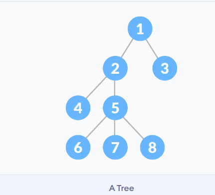
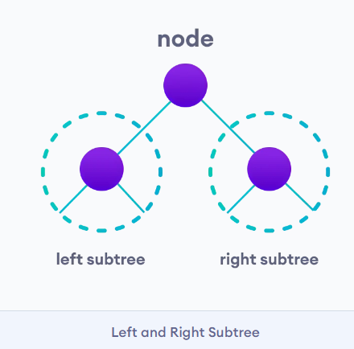
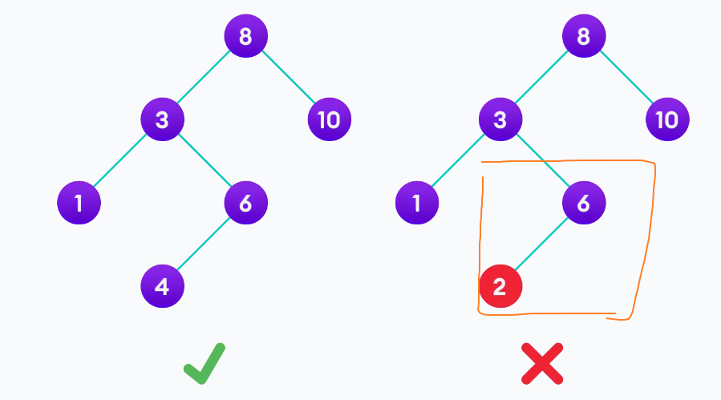
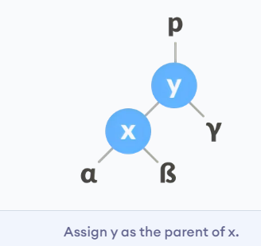

# 树 Tree

树是一种非线性层次结构。由相互连接的节点组成。
树结构在存储和搜索速度通常比较快。

## 树的术语
**节点Node**
节点包含键或值以及指向其子节点的指针。每个路径的最后一个节点（没有子节点）称为叶节点(leaf node)。

至少具有一个子节点的节点称为内部节点(internal node)。

**边 Edge**
它是任意两个节点之间的链接。


**根Root**
树的最顶层节点
**节点高度**
节点的高度是从节点到最深叶（即从节点到叶节点的最长路径）的边数。
**节点深度**
节点的深度是从根到节点的边数。
**树的高度**
树的高度是根节点的高度或最深节点的深度。
**节点的度数(Degree)**
节点的度数是该节点的分支总数。
**森林**
不相交的树的集合称为森林。

## 树的类型
- 二叉树(Binary Tree)
- 二叉搜索树(Binary Search Tree)
- 平衡树(AVL Tree)
- B树(B-Tree)

### 树应用
- 二叉搜索树 （BST） 用于快速检查元素是否存在于集合中。
- 堆是一种用于堆排序的树。
- 现代路由器中使用名为 Tries 的树的修改版本来存储路由信息。
- 大多数流行的数据库使用B树和T树，它们是我们上面学习的树结构的变体，用于存储其数据
- 编译器使用语法树来验证您编写的每个程序的语法。

# 树遍历 中序遍历、前序遍历、后序遍历
树的遍历是访问树的所有节点。

根据访问根的顺序，可以分成中序遍历（左根右）、前序遍历（根左右）、后序遍历（左右根）
中序遍历(inorder)
```py
inorder(root->left)
display(root->data)
inorder(root->right)
```
前序遍历 preorder
```py
display(root->data)
preorder(root->left)
preorder(root->right)
```
后序遍历 psotorder
```py
postorder(root->left)
postorder(root->right)
display(root->data)
```

```py
# Tree traversal in Python


class Node:
    def __init__(self, item):
        self.left = None
        self.right = None
        self.val = item


def inorder(root):

    if root:
        # Traverse left
        inorder(root.left)
        # Traverse root
        print(str(root.val) + "->", end='')
        # Traverse right
        inorder(root.right)


def postorder(root):

    if root:
        # Traverse left
        postorder(root.left)
        # Traverse right
        postorder(root.right)
        # Traverse root
        print(str(root.val) + "->", end='')


def preorder(root):

    if root:
        # Traverse root
        print(str(root.val) + "->", end='')
        # Traverse left
        preorder(root.left)
        # Traverse right
        preorder(root.right)


root = Node(1)
root.left = Node(2)
root.right = Node(3)
root.left.left = Node(4)
root.left.right = Node(5)

print("Inorder traversal ")
inorder(root)

print("\nPreorder traversal ")
preorder(root)

print("\nPostorder traversal ")
postorder(root)
```

# 二叉树
二叉树是一种树数据结构，其中每个父节点最多可以有两个子节点。
## 二叉树类型
1.满二叉树Full Binary Tree 
每个父节点有两个子节点或没有子节点。

2.Perfect Binary Tree
每个内部节点正好有两个子节点，并且所有叶节点都处于同一级别。

3.完全二叉树Complete Binary Tree
完全二叉树就像满二叉树 ，但有以下区别
1. 每个级别都必须完全填满
2. 所有叶元素必须向左倾斜。
3. 最后一个叶元素可能没有正确的同级，即完全二叉树不一定是满二叉树。


4.5.退化的树 （只有单独子节点）

6.平衡二叉树
每个节点的左子树和右子树的高度之差为 0 或 1。

# Full Binary Tree 满二叉树

满二叉树的每个父节点/内部节点有两个子节点或没有子节点。
满二叉树的性质：
Let, i = the number of internal nodes
       n = be the total number of nodes
       l = number of leaves
       λ = number of levels
The number of leaves is i + 1.
The total number of nodes is 2i + 1.
The number of internal nodes is (n – 1) / 2.
The number of leaves is (n + 1) / 2.
The total number of nodes is 2l – 1.
The number of internal nodes is l – 1.
The number of leaves is at most 2^(λ - 1).


判断满二叉树
```py
# Checking if a binary tree is a full binary tree in Python


# Creating a node
class Node:

    def __init__(self, item):
        self.item = item
        self.leftChild = None
        self.rightChild = None


# Checking full binary tree
def isFullTree(root):

    # Tree empty case
    if root is None:
        return True

    # Checking whether child is present
    if root.leftChild is None and root.rightChild is None:
        return True

    if root.leftChild is not None and root.rightChild is not None:
        return (isFullTree(root.leftChild) and isFullTree(root.rightChild))

    return False


root = Node(1)
root.rightChild = Node(3)
root.leftChild = Node(2)

root.leftChild.leftChild = Node(4)
root.leftChild.rightChild = Node(5)
root.leftChild.rightChild.leftChild = Node(6)
root.leftChild.rightChild.rightChild = Node(7)

if isFullTree(root):
    print("The tree is a full binary tree")
else:
    print("The tree is not a full binary tree")

```

# 完美二叉树
每个内部节点正好有两个子节点，并且所有叶节点都处于同一级别。

所有内部节点的度数均为 2。

递归地，完美的二叉树可以定义为：

1. 如果单个节点没有子节点，则它是高度h = 0的完美二叉树，
2. 如果一个节点有h > 0 ，如果它的两个子树都是高度h - 1的并且不重叠，它就是一个完美的二叉树。

判断完美二叉树
```py
# Checking if a binary tree is a perfect binary tree in Python


class newNode:
    def __init__(self, k):
        self.key = k
        self.right = self.left = None


# Calculate the depth
def calculateDepth(node):
    d = 0
    while (node is not None):
        d += 1
        node = node.left
    return d


# Check if the tree is perfect binary tree
def is_perfect(root, d, level=0):

    # Check if the tree is empty
    if (root is None):
        return True

    # Check the presence of trees
    if (root.left is None and root.right is None):
        return (d == level + 1)

    if (root.left is None or root.right is None):
        return False

    return (is_perfect(root.left, d, level + 1) and
            is_perfect(root.right, d, level + 1))


root = None
root = newNode(1)
root.left = newNode(2)
root.right = newNode(3)
root.left.left = newNode(4)
root.left.right = newNode(5)

if (is_perfect(root, calculateDepth(root))):
    print("The tree is a perfect binary tree")
else:
    print("The tree is not a perfect binary tree")
```

### Perfect Binary Tree Theorems
1. A perfect binary tree of height h has 2^(h + 1) – 1 node.
2. A perfect binary tree with n nodes has height log(n + 1) – 1 = Θ(ln(n)).
3. A perfect binary tree of height h has 2^h leaf nodes.
4. The average depth of a node in a perfect binary tree is Θ(ln(n)).


# 完全二叉树 Complete Binary Tree


完全二叉树的其中所有级别都被完全填充，除了最低层可能是从左侧填充。
注意完全二叉树和满二叉树的区别:


## 创建完全二叉树
按照从左到右的顺序，可以从数组创建完全二叉树


## 判断完全二叉树
```py
# Checking if a binary tree is a complete binary tree in C


class Node:

    def __init__(self, item):
        self.item = item
        self.left = None
        self.right = None


# Count the number of nodes
def count_nodes(root):
    if root is None:
        return 0
    return (1 + count_nodes(root.left) + count_nodes(root.right))


# Check if the tree is complete binary tree
def is_complete(root, index, numberNodes):

    # Check if the tree is empty
    if root is None:
        return True

    if index >= numberNodes:
        return False

    return (is_complete(root.left, 2 * index + 1, numberNodes)
            and is_complete(root.right, 2 * index + 2, numberNodes))


root = Node(1)
root.left = Node(2)
root.right = Node(3)
root.left.left = Node(4)
root.left.right = Node(5)
root.right.left = Node(6)

node_count = count_nodes(root)
index = 0

if is_complete(root, index, node_count):
    print("The tree is a complete binary tree")
else:
    print("The tree is not a complete binary tree")
 
```
## 完全二叉树的性质
一个完全的二叉树有一个有趣的属性，我们可以用来查找任何节点的子节点和父节点。

对于索引为`i` 的节点，其左子元素的索引是`2i+1`，右子元素的索引是`2i+2`。父元素的索引是`(i-1)/2`的下限。

## 完全的二叉树应用程序
- 基于堆的数据结构
- 堆排序

# 平衡二叉树
平衡二叉树，也称为高度平衡二叉树，定义为任何节点的左右子树的高度相差不超过 1 的二叉树。

递归方式给出定义：
- 任何节点的左子树和右子树之间的差异不超过一个
- 左侧子树是平衡的
- 右侧子树是平衡的

检查平衡二叉树：
```py
# Checking if a binary tree is height balanced in Python


class Node:

    def __init__(self, data):
        self.data = data
        self.left = self.right = None


class Height:
    def __init__(self):
        self.height = 0


def isHeightBalanced(root, height):

    left_height = Height()
    right_height = Height()

    if root is None:
        return True

    l = isHeightBalanced(root.left, left_height)
    r = isHeightBalanced(root.right, right_height)

    height.height = max(left_height.height, right_height.height) + 1

    if abs(left_height.height - right_height.height) <= 1:
        return l and r

    return False


height = Height()

root = Node(1)
root.left = Node(2)
root.right = Node(3)
root.left.left = Node(4)
root.left.right = Node(5)

if isHeightBalanced(root, height):
    print('The tree is balanced')
else:
    print('The tree is not balanced')

```

# 二叉搜索树（Binary Search Tree, BST）
二叉搜索树是一种数据结构，可以快速允许我们维护排序的数字列表。

它被称为搜索树，因为它可以在O(log(n))时间搜索数字。

搜索树满足：
- 左节点（及其孩子节点）<根节点<右节点（及其孩子节点）
- 每个节点的左右孩子也是BST



## 搜索操作
由于搜索树的特性，搜索操作如下：
```py
If root == NULL 
    return NULL;
If number == root->data 
    return root->data;
If number < root->data 
    return search(root->left)
If number > root->data 
    return search(root->right)
```
## 插入操作
在正确的位置插入值类似于搜索，因为我们尝试维护左侧子树小于 root 和右侧子树大于 root 的规则。
```py
if node == NULL 
    return createNode(data)
if (data < node->data)
    node->left  = insert(node->left, data);
else if (data > node->data)
    node->right = insert(node->right, data);  
return node;
```

## 删除操作
从二叉搜索树中删除节点有三种情况。
1)在第一种情况下，要删除的节点是叶节点。在这种情况下，只需从树中删除节点即可。
2)要删除的节点具有单个子节点。在这种情况下，请按照以下步骤操作：
1. 将该节点替换为其子节点。
2. 将子节点从其原始位置删除

3)要删除的节点有两个子节点。在这种情况下，请按照以下步骤操作
1. 获取该节点的中序遍历(inorder)的后继节点。
2. 将节点替换为中序遍历的后继节点。
3. 将中序遍历的后继项从其原始位置删除。
```py
# Binary Search Tree operations in Python


# Create a node
class Node:
    def __init__(self, key):
        self.key = key
        self.left = None
        self.right = None


# Inorder traversal
def inorder(root):
    if root is not None:
        # Traverse left
        inorder(root.left)

        # Traverse root
        print(str(root.key) + "->", end=' ')

        # Traverse right
        inorder(root.right)


# Insert a node
def insert(node, key):

    # Return a new node if the tree is empty
    if node is None:
        return Node(key)

    # Traverse to the right place and insert the node
    if key < node.key:
        node.left = insert(node.left, key)
    else:
        node.right = insert(node.right, key)

    return node


# Find the inorder successor
def minValueNode(node):
    current = node

    # Find the leftmost leaf
    while(current.left is not None):
        current = current.left

    return current


# Deleting a node
def deleteNode(root, key):

    # Return if the tree is empty
    if root is None:
        return root

    # Find the node to be deleted
    if key < root.key:
        root.left = deleteNode(root.left, key)
    elif(key > root.key):
        root.right = deleteNode(root.right, key)
    else:
        # If the node is with only one child or no child
        if root.left is None:
            temp = root.right
            root = None
            return temp

        elif root.right is None:
            temp = root.left
            root = None
            return temp

        # If the node has two children,
        # place the inorder successor in position of the node to be deleted
        temp = minValueNode(root.right)

        root.key = temp.key

        # Delete the inorder successor
        root.right = deleteNode(root.right, temp.key)

    return root


root = None
root = insert(root, 8)
root = insert(root, 3)
root = insert(root, 1)
root = insert(root, 6)
root = insert(root, 7)
root = insert(root, 10)
root = insert(root, 14)
root = insert(root, 4)

print("Inorder traversal: ", end=' ')
inorder(root)

print("\nDelete 10")
root = deleteNode(root, 10)
print("Inorder traversal: ", end=' ')
inorder(root)
```

二叉搜索树应用
- 在数据库中的多级索引中
- 用于动态排序
- 用于管理 Unix 内核中的虚拟内存区

# AVL 自平衡的二叉搜索树
AVL树的名字来自它的发明者Georgy Adelson-Velsky和Landis。
AVL树是一个自平衡的二叉搜索树，其中每个节点都维护称为平衡因子的额外信息，其值为-1，0或+1。


## 平衡因子

AVL 树中节点的平衡因子是该节点的左侧子树的高度与右侧子树的高度之差。
平衡因子 =（左子树的高度 - 右子树的高度）或（右子树的高度 - 左子树的高度）
avl 树的自平衡属性由平衡因子保持。平衡因子的值应始终为 -1、0 或 +1。

## 对 AVL 树的操作
可以对 AVL 树执行的各种操作包括：

### 旋转 AVL 树中的子树
通过旋转操作，来调整左右子树的高度。
在旋转操作中，子树节点的位置是互换的。

有两种类型的旋转：
左旋转（L）和右旋转（R）。
左旋：
 

（X，Y向左移动一格）
右旋：


（X，Y向右移动一格）

左右（LR）和右左（RL）旋转。
LR旋转是先左旋，然后右旋：


RL类似，是先右旋，然后左旋：


## 插入新节点
1. `newNode`始终作为平衡因子等于 0 的叶节点插入。
2. 转到相应的叶节点以使用以下递归步骤插入newNode。newKey与当前树rootKey进行比较。
a.如果newKey< rootKey，则调用当前节点左侧子树上的插入算法，直到到达叶节点。
b.否则，如果newKey>rootKey，则在当前节点的右侧子树上调用插入算法，直到到达叶节点。
c.否则，返回leafNode
3. 将从上述步骤获得的leafKey比较newKey：
a.如果`newKey < leafKey`，则使 newNode 作为leftNode 的 leftChild。
b.否则，使newNode作为 leafNode的rightChild。
4. 更新所有节点的平衡因子
5. 如果节点不平衡，则重新平衡节点。
a. 如果balanceFactor> 1，则表示左侧子树的高度大于右侧子树的高度。所以，做一个右旋或左右旋转
  a.`如果newNodeKey<leftChildKey`，做右旋转。
  b.否则，做左右旋转。
b. 如果balanceFactor< -1，则表示右侧子树的高度大于左侧子树的高度。所以，做右旋或左右旋
  a.如果`newNodeKey>rightChildKey`做左旋。
  b.否则，做左右旋转
## 删除节点
节点始终作为叶节点删除。删除节点后，节点的平衡因子会发生变化。为了重新平衡平衡因子，需要执行适当的旋转。
1. 查找`nodeToBeDeleted`（递归）。
2. 删除节点有三种情况：
a. 如果是叶节点（即没有任何子节点），则删除 。
b. 如果有一个孩子，则用孩子的内容代替nodeToBeDeleted。删除孩子。
c. 如果有两个子节点，则在右侧子树中找到它的inorder后继者`w`。
3. 更新所有节点的平衡因子
4. 如果任何节点的平衡因子不等于 -1、0 或 1，则重新平衡树。
a. 如果currentNode的balanceFactor> 1，
  a. 如果leftChild的balanceFactor>= 0，则向右旋转。
  b.否则做lr旋转
b.如果currentNode的balanceFactor<-1，
  a.如果rightChild的balanceFactor<= 0，则左旋
  b. 否则做rl旋转


```py
# AVL tree implementation in Python


import sys

# Create a tree node
class TreeNode(object):
    def __init__(self, key):
        self.key = key
        self.left = None
        self.right = None
        self.height = 1


class AVLTree(object):

    # Function to insert a node
    def insert_node(self, root, key):

        # Find the correct location and insert the node
        if not root:
            return TreeNode(key)
        elif key < root.key:
            root.left = self.insert_node(root.left, key)
        else:
            root.right = self.insert_node(root.right, key)

        root.height = 1 + max(self.getHeight(root.left),
                              self.getHeight(root.right))

        # Update the balance factor and balance the tree
        balanceFactor = self.getBalance(root)
        if balanceFactor > 1:
            if key < root.left.key:
                return self.rightRotate(root)
            else:
                root.left = self.leftRotate(root.left)
                return self.rightRotate(root)

        if balanceFactor < -1:
            if key > root.right.key:
                return self.leftRotate(root)
            else:
                root.right = self.rightRotate(root.right)
                return self.leftRotate(root)

        return root

    # Function to delete a node
    def delete_node(self, root, key):

        # Find the node to be deleted and remove it
        if not root:
            return root
        elif key < root.key:
            root.left = self.delete_node(root.left, key)
        elif key > root.key:
            root.right = self.delete_node(root.right, key)
        else:
            if root.left is None:
                temp = root.right
                root = None
                return temp
            elif root.right is None:
                temp = root.left
                root = None
                return temp
            temp = self.getMinValueNode(root.right)
            root.key = temp.key
            root.right = self.delete_node(root.right,
                                          temp.key)
        if root is None:
            return root

        # Update the balance factor of nodes
        root.height = 1 + max(self.getHeight(root.left),
                              self.getHeight(root.right))

        balanceFactor = self.getBalance(root)

        # Balance the tree
        if balanceFactor > 1:
            if self.getBalance(root.left) >= 0:
                return self.rightRotate(root)
            else:
                root.left = self.leftRotate(root.left)
                return self.rightRotate(root)
        if balanceFactor < -1:
            if self.getBalance(root.right) <= 0:
                return self.leftRotate(root)
            else:
                root.right = self.rightRotate(root.right)
                return self.leftRotate(root)
        return root

    # Function to perform left rotation
    def leftRotate(self, z):
        y = z.right
        T2 = y.left
        y.left = z
        z.right = T2
        z.height = 1 + max(self.getHeight(z.left),
                           self.getHeight(z.right))
        y.height = 1 + max(self.getHeight(y.left),
                           self.getHeight(y.right))
        return y

    # Function to perform right rotation
    def rightRotate(self, z):
        y = z.left
        T3 = y.right
        y.right = z
        z.left = T3
        z.height = 1 + max(self.getHeight(z.left),
                           self.getHeight(z.right))
        y.height = 1 + max(self.getHeight(y.left),
                           self.getHeight(y.right))
        return y

    # Get the height of the node
    def getHeight(self, root):
        if not root:
            return 0
        return root.height

    # Get balance factore of the node
    def getBalance(self, root):
        if not root:
            return 0
        return self.getHeight(root.left) - self.getHeight(root.right)

    def getMinValueNode(self, root):
        if root is None or root.left is None:
            return root
        return self.getMinValueNode(root.left)

    def preOrder(self, root):
        if not root:
            return
        print("{0} ".format(root.key), end="")
        self.preOrder(root.left)
        self.preOrder(root.right)

    # Print the tree
    def printHelper(self, currPtr, indent, last):
        if currPtr != None:
            sys.stdout.write(indent)
            if last:
                sys.stdout.write("R----")
                indent += "     "
            else:
                sys.stdout.write("L----")
                indent += "|    "
            print(currPtr.key)
            self.printHelper(currPtr.left, indent, False)
            self.printHelper(currPtr.right, indent, True)


myTree = AVLTree()
root = None
nums = [33, 13, 52, 9, 21, 61, 8, 11]
for num in nums:
    root = myTree.insert_node(root, num)
myTree.printHelper(root, "", True)
key = 13
root = myTree.delete_node(root, key)
print("After Deletion: ")
myTree.printHelper(root, "", True)
```