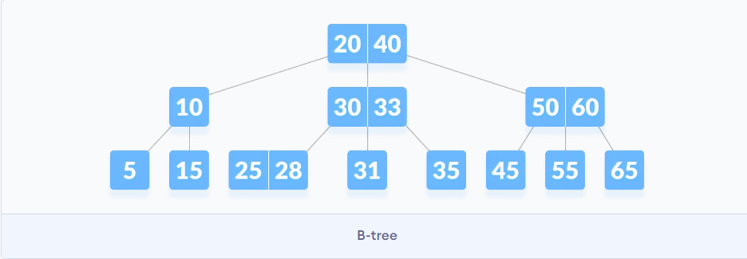

# B-tree B树
**B树是干嘛的？**
B 树是为硬盘等辅助存储设备设计的，用来最大限度地减少磁盘访问。许多数据库使用B树或B树变体来存储信息。

B-tree 是一种特殊类型的自平衡搜索树，其中每个节点可以包含多个键，并且可以有两个以上的子节点。它是二叉搜索树的广义形式。

B树的节点有n个关键字，n+1个孩子节点用这n个关键字隔开。

## B树定义
为了简单，我们假定和关键字相联系的“卫星数据”和关键字一起放在一个节点中。也就是关键字和卫星数据绑定了。下面给出B树的定义。
一颗B树T是具有以下性质的有根树（跟为T.root）：
1. 任意节点x满足：
   a. x.n 表示存储在节点x中的关键字个数。
   b. x.n 个关键字x.key_1, x.key_2,...,x,key_x.n以非降序存放。
   c. x.leaf 是一个布尔值。表示x是否为叶节点。
2. 每个内部节点x还包含(x.n) + 1个指向器孩子的指针$x.c_1, x.c_2, ... x.c_{(x.n)+1}$。叶节点没有孩子。
3. 关键字$x.key_i$对存储在各子树中的关键字加以分割：如果$k_i$为任意一个存储在以$x.c_i$为根的子树中的关键字，那么
$k_1 \le x.key_1 \le k_2 \le x.key_2 \le ... \le x.key_{x.n} \le k_{x.n+1}$
4. 所有叶子都具有相同的深度（即树的高度h）。
5. 每个节点包含的关键字有上界和下界，使用B树的最小度数(t>=2)表示这两个界：
a. 除根节点外，每个节点至少有`t-1`个关键字(t个孩子)。。如果树非空，根结点至少有1个关键字。
b.每个节点至多包含2t-1个关键字(2t个孩子)，如果恰好有2t-1个关键字，则成节点是满的。

t=2时的B树是最简单的。每个内部节点有2、3、4个孩子，称为2-3-4树。然而，t越大，B树的高度越小。

B树的高度
B树上的大部分操作所需的磁盘存取次数和B数高度成正比。最坏情况下B树的高度
$h \le log_t{\frac{n+1}{2}}$ 。
其中n为关键字数量，t为最小度。  $n \ge 1, t\ge 2 $。

## B树的操作
在这些过程中，我们采用两个约定：
•B树的根结点始终在主存中，这样无需对根做DISK-READ操作；然而，当根结点被改变后，需要对根结点做一次DISK-WRITE操作。
•任何被当做参数的结点在被传递之前，都要对它们先做一次DISK-READ操作。
**搜索 B 树中的元素**
搜索B树和搜索二叉树类似，只是每个节点不是二叉，而是根据黑点的孩子进行多路选择。
在x及其子树中搜索k的算法`BtreeSearch(x,k)`如下：
$$
\begin{align*}
& BtreeSearch(x, k)：\\
& i = 1 \\
& while\hspace{1em} i ≤ x.n \hspace{1em} and \hspace{1em} k > x.key_i  \\
& \hspace{2em} i = i+ 1 \\
& if \space i \le x.n and k == x.key_i \\
& \hspace{2em} return (x,i) \\
& elif \space x.leaf\\
& \hspace{2em} return NIL \\
& else \space DISK-READ(x, c_i) \\
&\hspace{2em} return \space BtreeSearch(x.c_i ,k)
\end{align*}
$$


1. 从根节点开始，将 k 与节点的第一个键进行比较。如果`k = the first key of the node`，则返回节点和索引。
2. 如果为`k.leaf = true`，则返回NULL（即未找到）。
3. 如果`k < the first key of the root node` ，则以递归方式搜索此键的**左子项**。
4. 如果当前节点中有多个键且`k > the first key`，则将 k 与节点中的下一个键进行比较。
如果`k < next key`，则搜索此键的左子项（即 k 位于第一个和第二个键之间）。
否则，搜索密钥的右子项。
1. 重复步骤 1 到 4，直到到达叶子。


```py
# Searching a key on a B-tree in Python


# Create a node
class BTreeNode:
  def __init__(self, leaf=False):
    self.leaf = leaf
    self.keys = []
    self.child = []


# Tree
class BTree:
  def __init__(self, t):
    self.root = BTreeNode(True)
    self.t = t

    # Insert node
  def insert(self, k):
    root = self.root
    if len(root.keys) == (2 * self.t) - 1:
      temp = BTreeNode()
      self.root = temp
      temp.child.insert(0, root)
      self.split_child(temp, 0)
      self.insert_non_full(temp, k)
    else:
      self.insert_non_full(root, k)

    # Insert nonfull
  def insert_non_full(self, x, k):
    i = len(x.keys) - 1
    if x.leaf:
      x.keys.append((None, None))
      while i >= 0 and k[0] < x.keys[i][0]:
        x.keys[i + 1] = x.keys[i]
        i -= 1
      x.keys[i + 1] = k
    else:
      while i >= 0 and k[0] < x.keys[i][0]:
        i -= 1
      i += 1
      if len(x.child[i].keys) == (2 * self.t) - 1:
        self.split_child(x, i)
        if k[0] > x.keys[i][0]:
          i += 1
      self.insert_non_full(x.child[i], k)

    # Split the child
  def split_child(self, x, i):
    t = self.t
    y = x.child[i]
    z = BTreeNode(y.leaf)
    x.child.insert(i + 1, z)
    x.keys.insert(i, y.keys[t - 1])
    z.keys = y.keys[t: (2 * t) - 1]
    y.keys = y.keys[0: t - 1]
    if not y.leaf:
      z.child = y.child[t: 2 * t]
      y.child = y.child[0: t - 1]

  # Print the tree
  def print_tree(self, x, l=0):
    print("Level ", l, " ", len(x.keys), end=":")
    for i in x.keys:
      print(i, end=" ")
    print()
    l += 1
    if len(x.child) > 0:
      for i in x.child:
        self.print_tree(i, l)

  # Search key in the tree
  def search_key(self, k, x=None):
    if x is not None:
      i = 0
      while i < len(x.keys) and k > x.keys[i][0]:
        i += 1
      if i < len(x.keys) and k == x.keys[i][0]:
        return (x, i)
      elif x.leaf:
        return None
      else:
        return self.search_key(k, x.child[i])
      
    else:
      return self.search_key(k, self.root)


def main():
  B = BTree(3)

  for i in range(10):
    B.insert((i, 2 * i))

  B.print_tree(B.root)

  if B.search_key(8) is not None:
    print("\nFound")
  else:
    print("\nNot Found")


if __name__ == '__main__':
  main()
```
**创建B树**
B-TREE-CREATE(T) 
l x = ALLOCATE-NODE() 
2 x.leaf = TRUE 
3 x.n = 0 
4 DISK-WRITE(x) 
5 T.root=x 

# B树插入关键字
B树的插入操作比较复杂，不能简单创建一个新的叶节点并插入，因为这样这样得到的树可能不是合法的B树。
我们是将关键字插入到已存在的叶节点上。但是无法插入到满的叶节点上，所以要引入一个分裂操作：将一个满的节点y，按照其中间关键字y.key_t分裂成两个t-1个关键字的节点，中间节点提升到y的父节点。（如果y的父节点也是满的，则需向上传播分裂）
分裂B树中的节点B-TREE-SPLIT-CHILD(x, i)，x是非满的内部节点x，i是使x.c_i为满的下标。
```
B-TREE-SPLIT-CHILD(x, i) 
l z = ALLOCATE-NODE() 
2 y = x.c_i 
3 z.leaf = y.leaf 
4 z.n = t - l 
5 for j=l to t—l 
6   z.key_j= y.key_{j+1}
7 if not y.leaf 
8  for j=l to t 
9     z, c_j = y.c_{j+t} 
10 y.n = t —l 
11 for j = x.n + l downto i + 1 
12   x, c_{j+1} = x.c_j; 
13 x.c_{i+1} = z 
14 for j = x.n downto i 
15   x.key_i = x.key_j; 
16 x.key_i= y.key_t 
17 x.n = x.n + 1 
18 DISK-WRITE(y) 
19 DISK-WRITE(z) 
20 DISK-WRITE(x) 
```
以沿树单程下行方式向B树插入关键字
```
B-TREE-INSERT(T, k) 
1 r = T.root 
2 if r.n == 2t-1 
3   s = ALLOCATE-NODE() 
4   T.root=s 
5   s.leaf= FALSE 
6   s.n = 0 
7   s.c_1 = r 
8   B-TREE-SPLIT-CHILD(s, 1) 
9   B-TREE-INSERT-NONFULL(s, k) 
10 else B-TREE-INSERT-NONFULL(r, k) 
```

```
B-TREE-INSERT-NONFULL(x, k) 
I i = x. n 
2 if x.leaf 
3   while i >= 1 and k < x.key_i 
4       x.key_i+1 = x.key_i 
5       i=i —1 
6   x.key_i+1 = k 
7   x.n = x.n + l 
8   DISK-WRITE(x) 
9 else while i >= 1 and k < x.key_i 
10      i = i —l 
11  i=i+l 
12  DISK-READ(x. c,) 
13  ifx.c_i.n== 2t —1 
14      B-TREE-SPLIT-CHILD(x, i) 
15      if k > x.key_i
16          i = i + 1 
17  B-TREE-INSERT-NONFULL(x.c_i, k) 
```
# B树删除
删除和插入类似，但略微复杂一些，因为删除可能在任意节点发生，不只是叶节点。
删除 B 树上的元素包括三个主要事件：**搜索**要删除的键所在的节点、**删除**键并在需要时**平衡**树。
删除树时，可能会出现称为下溢(underflow)的情况。当节点包含的key少于它应持有的最小key数时，会发生下溢。

在研究删除操作之前要理解的术语是：
1. 中序（inorder）前置节点 
节点左子节点上的最大键称为其中序前置节点。
2. 中序（inorder）后继节点 
节点右侧子节点上的最小键称为其中序后继键。
## 删除操作
在执行以下步骤之前，必须了解有关 m 度 B 树的这些事实。

一个节点最多可以有 m 个子节点。（即 3）
一个节点最多可以包含m - 1个键。（即 2）
一个节点应至少具有⌈m/2⌉子节点。（即 2）
节点（根节点除外）应包含最少⌈m/2⌉ - 1键。（即 1）

B 树中的删除关键字k主要有三种情况。
Case 1：
k位于叶节点x中，从x中删除k。

Case 2：
如果要删除的key位于内部节点x中，则会出现以下情况。
1. 如果x中前于k的字节点y至少有t个关键字，则找出k在以y为根的子树中的前驱k'，递归删除k'，并在x中用k'替代k。
2. 对称的，如果y有少于t个关键字，则检查x中后于k的子节点z。如果z至少有t个关键字，则找出k在以z为根的子树中的后继k'，递归删除k'，并在x中用k'替代k。
3. 否则，如果y和z都只有t-1个关键字，则将k和z全部合并到y，这样x就失去了k和z，并且y含有2t-1个关键字。然后释放z并递归从y中删除k。


case 3：
如果关键字k当前不在内部结点x中，则确定必包含k的子树的根x.c_i(如果k确实在树
中）。如x.c_i只有t-1个关键字，必须执行步骤3a或3b来保证降至一个至少包含t个关键字
的结点。然后，通过对x的某个合适的子结点进行递归而结束。

a.如果x.c_i只含有t—1个关键字，但是它的一个相邻的兄弟至少包含t个关键字，则将x中的某一个关键字降至x.c_i中，将x.c_i的相邻左兄弟或右兄弟的一个关键字升至x,将该兄弟中相应的孩子指针移到x.c_i中，这样就使得x.c_i增加了一个额外的关键字。
b.如果x.c_i以及x.c_i的所有相邻兄弟都只包含t—1个关键字，则将x.c_i与一个兄弟合并，即将x的一个关键字移至新合并的结点，使之成为该结点的中间关键字。
```py
# Deleting a key on a B-tree in Python


# Btree node
class BTreeNode:
    def __init__(self, leaf=False):
        self.leaf = leaf
        self.keys = []
        self.child = []


class BTree:
    def __init__(self, t):
        self.root = BTreeNode(True)
        self.t = t

    # Insert a key
    def insert(self, k):
        root = self.root
        if len(root.keys) == (2 * self.t) - 1:
            temp = BTreeNode()
            self.root = temp
            temp.child.insert(0, root)
            self.split_child(temp, 0)
            self.insert_non_full(temp, k)
        else:
            self.insert_non_full(root, k)

    # Insert non full
    def insert_non_full(self, x, k):
        i = len(x.keys) - 1
        if x.leaf:
            x.keys.append((None, None))
            while i >= 0 and k[0] < x.keys[i][0]:
                x.keys[i + 1] = x.keys[i]
                i -= 1
            x.keys[i + 1] = k
        else:
            while i >= 0 and k[0] < x.keys[i][0]:
                i -= 1
            i += 1
            if len(x.child[i].keys) == (2 * self.t) - 1:
                self.split_child(x, i)
                if k[0] > x.keys[i][0]:
                    i += 1
            self.insert_non_full(x.child[i], k)

    # Split the child
    def split_child(self, x, i):
        t = self.t
        y = x.child[i]
        z = BTreeNode(y.leaf)
        x.child.insert(i + 1, z)
        x.keys.insert(i, y.keys[t - 1])
        z.keys = y.keys[t: (2 * t) - 1]
        y.keys = y.keys[0: t - 1]
        if not y.leaf:
            z.child = y.child[t: 2 * t]
            y.child = y.child[0: t - 1]

    # Delete a node
    def delete(self, x, k):
        t = self.t
        i = 0
        while i < len(x.keys) and k[0] > x.keys[i][0]:
            i += 1
        if x.leaf:
            if i < len(x.keys) and x.keys[i][0] == k[0]:
                x.keys.pop(i)
                return
            return

        if i < len(x.keys) and x.keys[i][0] == k[0]:
            return self.delete_internal_node(x, k, i)
        elif len(x.child[i].keys) >= t:
            self.delete(x.child[i], k)
        else:
            if i != 0 and i + 2 < len(x.child):
                if len(x.child[i - 1].keys) >= t:
                    self.delete_sibling(x, i, i - 1)
                elif len(x.child[i + 1].keys) >= t:
                    self.delete_sibling(x, i, i + 1)
                else:
                    self.delete_merge(x, i, i + 1)
            elif i == 0:
                if len(x.child[i + 1].keys) >= t:
                    self.delete_sibling(x, i, i + 1)
                else:
                    self.delete_merge(x, i, i + 1)
            elif i + 1 == len(x.child):
                if len(x.child[i - 1].keys) >= t:
                    self.delete_sibling(x, i, i - 1)
                else:
                    self.delete_merge(x, i, i - 1)
            self.delete(x.child[i], k)

    # Delete internal node
    def delete_internal_node(self, x, k, i):
        t = self.t
        if x.leaf:
            if x.keys[i][0] == k[0]:
                x.keys.pop(i)
                return
            return

        if len(x.child[i].keys) >= t:
            x.keys[i] = self.delete_predecessor(x.child[i])
            return
        elif len(x.child[i + 1].keys) >= t:
            x.keys[i] = self.delete_successor(x.child[i + 1])
            return
        else:
            self.delete_merge(x, i, i + 1)
            self.delete_internal_node(x.child[i], k, self.t - 1)

    # Delete the predecessor
    def delete_predecessor(self, x):
        if x.leaf:
            return x.pop()
        n = len(x.keys) - 1
        if len(x.child[n].keys) >= self.t:
            self.delete_sibling(x, n + 1, n)
        else:
            self.delete_merge(x, n, n + 1)
        self.delete_predecessor(x.child[n])

    # Delete the successor
    def delete_successor(self, x):
        if x.leaf:
            return x.keys.pop(0)
        if len(x.child[1].keys) >= self.t:
            self.delete_sibling(x, 0, 1)
        else:
            self.delete_merge(x, 0, 1)
        self.delete_successor(x.child[0])

    # Delete resolution
    def delete_merge(self, x, i, j):
        cnode = x.child[i]

        if j > i:
            rsnode = x.child[j]
            cnode.keys.append(x.keys[i])
            for k in range(len(rsnode.keys)):
                cnode.keys.append(rsnode.keys[k])
                if len(rsnode.child) > 0:
                    cnode.child.append(rsnode.child[k])
            if len(rsnode.child) > 0:
                cnode.child.append(rsnode.child.pop())
            new = cnode
            x.keys.pop(i)
            x.child.pop(j)
        else:
            lsnode = x.child[j]
            lsnode.keys.append(x.keys[j])
            for i in range(len(cnode.keys)):
                lsnode.keys.append(cnode.keys[i])
                if len(lsnode.child) > 0:
                    lsnode.child.append(cnode.child[i])
            if len(lsnode.child) > 0:
                lsnode.child.append(cnode.child.pop())
            new = lsnode
            x.keys.pop(j)
            x.child.pop(i)

        if x == self.root and len(x.keys) == 0:
            self.root = new

    # Delete the sibling
    def delete_sibling(self, x, i, j):
        cnode = x.child[i]
        if i < j:
            rsnode = x.child[j]
            cnode.keys.append(x.keys[i])
            x.keys[i] = rsnode.keys[0]
            if len(rsnode.child) > 0:
                cnode.child.append(rsnode.child[0])
                rsnode.child.pop(0)
            rsnode.keys.pop(0)
        else:
            lsnode = x.child[j]
            cnode.keys.insert(0, x.keys[i - 1])
            x.keys[i - 1] = lsnode.keys.pop()
            if len(lsnode.child) > 0:
                cnode.child.insert(0, lsnode.child.pop())

    # Print the tree
    def print_tree(self, x, l=0):
        print("Level ", l, " ", len(x.keys), end=":")
        for i in x.keys:
            print(i, end=" ")
        print()
        l += 1
        if len(x.child) > 0:
            for i in x.child:
                self.print_tree(i, l)


B = BTree(3)

for i in range(10):
    B.insert((i, 2 * i))

B.print_tree(B.root)

B.delete(B.root, (8,))
print("\n")
B.print_tree(B.root)
```
# B+ 树
B+ 树是自平衡树的高级形式，其中所有值都存在于叶节点中。
**B+ 树的属性**
1. 所有叶子都处于同一水平。
2. 根至少有两个子项。
3. 除根节点之外的每个节点最多可以有m子节点和至少m/2子节点。
4. 每个节点可以包含最多m- 1个key和最少⌈m/2⌉- 1个key。
# B+树插入（略）
# B+树删除（略）
# 红黑树
# 红黑树插入
# 红黑树删除