视频简介：https://www.youtube.com/playlist?list=PLkZYeFmDuaN2-KUIv-mvbjfKszIGJ4FaY
视频教程：https://www.bilibili.com/video/BV1UP4y1W7hX
java版本：github.com/williamfiset/data-structures
Python版本：https://github.com/akzare/Algorithms


programiz网站教程：https://www.programiz.com/dsa
programiz网站教程（中文，好像是机翻）：https://miz.apachecn.org/#/docs/dsal/3

# 1.DSA简介
## 1.1 什么是DSA，为什么学习？
数据结构是用于存储和组织数据，算法是解决特定问题的步骤集合。学习数据结构和算法使我们能够编写高效和优化的计算机程序。
>注：数据结构和算法DataStructure & Algorithms（DSA），后面简称DSA

(Abstract Data Types, ADT) vs. Data Structures
ADT是数据结构的抽象，只描述数据结构应该提供哪些接口，而不涉及具体实现。 DS则是具体实现。
例如，List是ADT，具体的实现可以用动态数组或链表实现。


为什么学习DSA？
从程序角度，学好数据结构和算法才能更有效的完成任务。例如排序，如果没有学过DSA，大概只能写出`O(N^2)`的算法，学过算法后，就会知道`O(NlogN)`的算法。
从现实角度，数据结构和算法是公司招聘时考察的重要部分。

### 相关的书籍
- Introduction to Algorithms（算法导论）, Thomas H. Cormen - it is one of the best books in algorithms and covers a broad range of algorithms in-depth
- Algorithms（算法）, Robert Sedgewick - it is the leading textbook on algorithms and is widely used in colleges and universities
- The Art of Computer Programming（计算机编程的艺术）, Donald E. Knuth - this book is considered best if you know the subject and are looking for deeper understanding

## 1.2 数据结构和类型
数据结构用来存储和组织数据。
基本上，数据结构可以分为两类：
- 线性数据结构
- 非线性数据结构

### 线性数据结构
线性数据结构中，元素是一个接着一个的有序序列。常见的线性数据结构有：
1. Array（数组）
数组在内存的存储是连续的。数组中的元素是同一类型的。
2. Stack （栈）
栈是一种后进先出(last in first out, LIFO)的数据结构。
3. Queue（队列）
队列是一种先进先出(FIFO)的数据结构。
4. Linked List（链表）
链表中的元素是一串节点(nodes)，每个节点保存数据和下一个节点的地址。

### 非线性数据结构
非线性数据结构没有特定的顺序。只是定义了元素间的连接关系。
1. Graph（图）
图中的每个节点称为顶点(vertex),顶点间通过边(edge)连接。
2. Tree（树）
树是一种特殊的图（无环图）


## 1.3 渐进(asymptotic)分析 大O符号
大O表示法表示算法运行时间的上限。 因此，它给出了算法的最坏情况的复杂度。大O表示法是最常用的。
例如，查找长度为`N`的数组中值为`99`的元素的位置，最坏情况（元素在数组的最后或者元素不存在），要执行`N`次判断操作，则查找时间复杂度为`O(N)`。

常见的时间复杂的有：
- 常数 O(1)
- 对数 O(log(n))
- 线性 O(n)
- Linearithmic O(nlog(n))
- 平方 O(n^2)

O表示法通常只关注级别，有以下属性：
O(n+c) = O(n)
O(cn) = O(n), c>0

例如，f(n) 15n^2 + 2n^3 + 8， 则O(f(n)) = O(n^3)
下面是一些具体的例子
常数复杂度O(1)：
```py
a = 1
b = 2
c = a + b
```
线性复杂度O(n)：
```py
i = 0
while i < n:
    i = i + 1
```
平方复杂度O(n^2)
```py
for i in range(n):
    for j in range(n):
        ...
```


Theta(Θ)表示法从上方和下方将函数括起来，代表算法运行时间的上限和下限。
Ω表示算法运行时间的下限。


## 1.4 主定理和分治算法(略)
### 主定理
主定理是用来计算递推关系`T(n) = aT(n/b) + f(n),`的时间复杂度。
如果a ≥ 1和b > 1是常数，并且f(n)是渐近正函数，则递归关系的时间复杂度由下式给出：
$$
T(n) = aT(n/b) + f(n)
$$
其中, $T(n)$ 有下列渐进边界:


主定理的求解示例
$T(n) = 3T(n/2) + n^2$


主定理的局限性
在以下情况下，不能使用主定理：

- T(n)不是单调的。 例如。T(n) = sin n
- f(n)不是多项式。 例如。f(n) = 2^n
- a不是常数。 例如。a = 2n
- a < 1

https://zhuanlan.zhihu.com/p/113406812

### 分治算法(Divide and Conquer)（略）
分治即分而治之，分治算法解决问题的步骤为：
1. 将问题分解成更小的子问题
2. 解决子问题（这个过程可以继续分解，直到子问题可以直接解决）
3. 合并子问题的解

下面是使用分治算法解决排序的例子。（归并排序 merge sort)


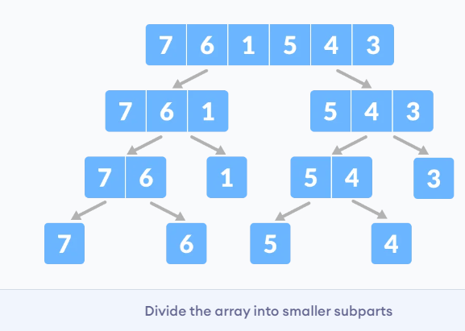


可用主定理分析时间复杂度


**Divide and Conquer Vs Dynamic approach（动态规划）**

分治的方法将问题分为较小的子问题，这些子问题可以递归进一步解决。 每个子问题的结果都不存储以供将来参考，而在动态方法中，每个子问题的结果均存储以供将来参考。

当同一子问题无法多次解决时，请使用分治的方法。 当将来要多次使用子问题的结果时，请使用动态方法。

让我们通过一个例子来理解这一点。 假设我们试图找到斐波那契数列。 
分治：
```py
fib(n)
    If n < 2, return 1
    Else , return f(n - 1) + f(n -2)
```
动态规划：
```py
mem = [ ]
fib(n)
    If n in mem: return mem[n] 
    else,     
        If n < 2, f = 1
        else , f = f(n - 1) + f(n -2)
        mem[n] = f
        return f
```


# List
## static Array?
static Array（静态数组）是固定长度的容器，内部元素可以索引，索引范围是[0, n-1]。
可索引(indexable)意味着每个元素可以通过一个数字访问。

static array 在内存中是连续存储的，因此static array的地址是连续的。

static array的用处：
- 存储和访问序列数据
- 暂时存储对象
- IO buffer


注意，索引从0开始。

## Dynamic Array
Dynamic Array(动态数组)长度可变。

如何通过静态数组实现动态数组？
给静态数组一个初始长度，（添加元素时）当存储的元素数量超出数组长度时，分配一个长度翻倍的数组，将原来数组的元素复制过来。

>Python没有静态数组，只有动态数组。Python提供了一个array标准库，提供固定数据类型的动态数组。


## Singly and Doubly Linked Lists
A linked list is a sequential list of nodes that hold data which point to other nodes also containing data.
链表由一系列节点组成，每个节点都存储数据和指向下一个节点的指针。

链表用处
-  List, Queue & Stack 的实现
- 创建circular lists
- 对循环事物建模

链表相关术语
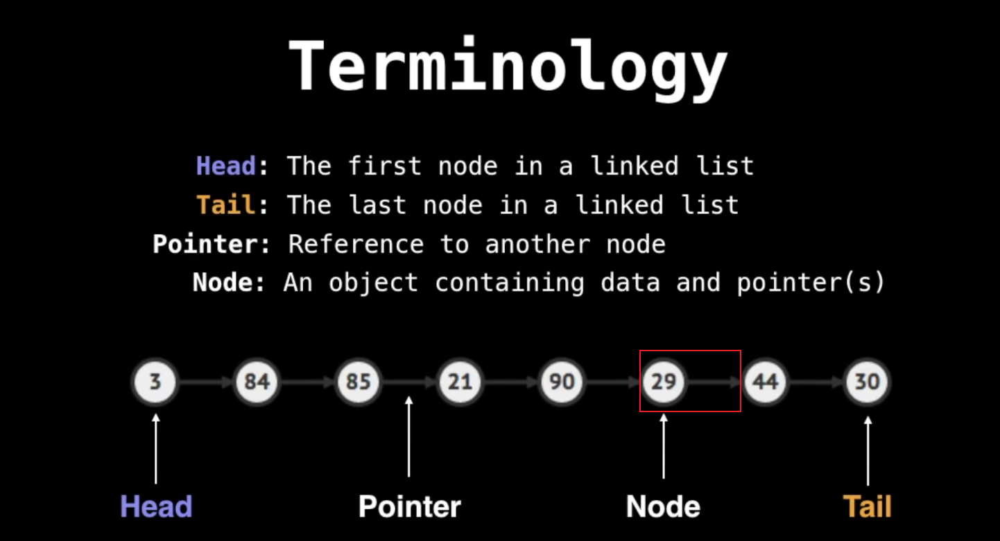  

双向链表的每个节点有两个指针，分别指向下一个节点和上一个节点。这样就可以方便地访问前一个节点，给一些操作（如删除）带来遍历。但存储的指针翻倍，更占内存。

**插入 Insert**
视频 40:44
**删除 Remove**
视频 43:43


#  Stack

栈中元素后进先出。我们把添加元素称为`push`，取出元素称为`pop`.

### 栈的操作
栈是一个允许执行以下操作的抽象数据结构（ADT）：
`Push`：将元素添加到栈顶部
`Pop`：从栈顶部删除元素
`IsEmpty`：检查栈是否为空
`IsFull`：检查栈是否已满
`Peek`：获取顶部元素的值而不删除它


**栈的应用**
尽管栈是一个易于实现的简单数据结构，但它非常强大。 栈最常见的用途是：
- 括号匹配
- 模拟汉诺塔
- **反转**单词: 将所有字母叠放并弹出。 由于栈的 LIFO 顺序，您将获得相反顺序的字母。
- 在编译器中: 编译器使用栈通过将表达式转换为前缀或后缀形式来计算2 + 4 / 5 * (7 - 9)之类的表达式的值。
- 在浏览器中: 浏览器中的“后退”按钮会将您以前访问过的所有 URL 保存在栈中。 每次您访问新页面时，它都会被添加到栈顶部。 当您按下“后退”按钮时，当前 URL 从栈中删除，并访问前一个 URL

例：括号匹配
```
S = stack
for bracket in bracket_string:
    rev = getReversedBracket(bracket)
    if isLeftBracket(bracket):
        S.push(bracket)
    elif S.isEmpty() or S.pop() != rev:
        return False
return S.isEmpty() 
```
### 栈的实现
使用指针TOP用于跟踪栈中的顶部元素。
初始化栈时，将其值设置为`-1`，以便通过比较`TOP == -1`来检查栈是否为空。
推入元素时，增加TOP的值，然后将新元素放置在TOP指向的位置。
弹出元素时，返回TOP指向的元素并减小其值。
推入之前，检查栈是否已满
弹出之前，检查栈是否已为空

Python实现
>网站上的Python实现有点太简单了，并没有使用数组，而是利用了list的一些功能（append、pop、len)。如果这样，list本身就可以当做stack和queue使用。
>但是貌似也没什么问题，LeetCode等刷题网站也是可以这样做的。所以后面提供
>简单方法 和 不使用list功能的2个版本。

网站版本(https://www.programiz.com/dsa/stack)
下面是自己用类写的版本：
```py
# Stack
class Stack:
    def __init__(self, size):
        self.size = size
        self.stack = []

    def push(self, ele):
        self.stack.append(ele)

    def pop(self):
        if self.is_empty():
            print("stack is empty")
            return None
        return self.stack.pop()

    def is_empty(self):
        return len(self.stack) == 0

    def is_full(self):
        return len(self.stack) == self.size

    def __str__(self):
        return str(self.stack)


if __name__ == '__main__':
    stack = Stack(10)
    for i in range(4):
        stack.push(str(i))
    print("stack  " + str(stack))
    print("popped item: " + stack.pop())
    print("stack after popping an element: " + str(stack))
```

不使用list特性的实现(参考java）：
```py
# Stack
class Stack2:
    def __init__(self, size):
        self.size = size
        self.stack = [None]* size
        self.top = -1

    def push(self, ele):
        if self.is_full():
            print("stack is full, cancel push")
            return
        self.top += 1
        self.stack[self.top] = ele

    def pop(self):
        if self.is_empty():
            print("stack is empty")
            return None
        res = self.stack[self.top]
        self.top -= 1
        return res

    def is_empty(self):
        return self.top == -1

    def is_full(self):
        return self.top == self.size -1

    def __str__(self):
        return str(self.stack[:self.top+1]) if self.top != -1 else str([])


if __name__ == '__main__':
    stack = Stack2(10)
    for i in range(11):
        stack.push(str(i))
    print("stack  " + str(stack))
    print("popped item: " + stack.pop())
    print("stack after popping an element: " + str(stack))
```
**测试**：https://leetcode.cn/problems/implement-stack-using-queues/
**栈的时间复杂度**
对于基于数组的栈实现，推入和弹出操作需要固定时间，即`O(1)`，因为在两种情况下都只有指针移动。


  

#  Queue
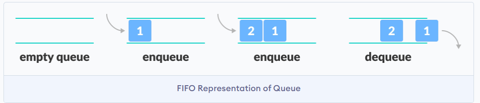
队列元素先进先出。我们将放入元素称为`enqueue`，取出元素称为`dequeue`。

**队列的操作**：
- Enqueue: 入队，在队列末尾添加元素
- Dequeue: 出队，在队列开头移除元素
- IsEmpty: Check if the queue is empty
- IsFull: Check if the queue is full
- Peek: 获取队列开头元素但不移除


**队列应用**
- CPU 调度，磁盘调度
- 在两个进程之间异步传输数据时，使用队列进行同步。 例如：IO 缓冲区，管道，文件 IO 等
- 实时系统中的中断处理。
- 模拟真实世界队列，如呼叫中心电话系统使用队列来保持人们按顺序呼叫他们
- 图的BFS搜索

例，图的BFS搜索（广度优先）：
```
Q = Queue
Q.enqueue(starting_node)
starting_node.visited = True

while Q is not empty:
    node = Q.dequeue()
    for neighbour in neighbours(node):
        if neighbour has not been visited:
            neighbour.visited = True
            Q.enqueu(neighbour)
```


**队列的实现**
（这个实现是基于不可变数组的，在Python中实现比较简单，不需要指针概念）
使用两个指针`FRONT`和`REAR`分布追踪队列开头和结尾元素。指针初始值为`-1`。
Enqueue：
- 检查队列是否已满。
- 如果是第一个元素，设置`FRONT`为0。
- `REAR`索引加1,将新元素放到`REAR`所指的位置。
Dequeue：
- 检查队列是否为空。
- 返回`FRONT`所指元素。
- `FRONT` 加1
- 如果是最后一个元素，设置`FRONT`和`REAR`为-1。


Queue的Python实现
```py
# Queue implementation in Python

class Queue:

    def __init__(self):
        self.queue = []

    # Add an element
    def enqueue(self, item):
        self.queue.append(item)

    # Remove an element
    def dequeue(self):
        if len(self.queue) < 1:
            return None
        return self.queue.pop(0)

    # Display  the queue
    def display(self):
        print(self.queue)

    def size(self):
        return len(self.queue)


q = Queue()
q.enqueue(1)
q.enqueue(2)
q.enqueue(3)
q.enqueue(4)
q.enqueue(5)

q.display()

q.dequeue()

print("After removing an element")
q.display()
```
注意，由于利用了list的方法，所以没有实现isfull(), isempty()等。

版本二（不利用list方法）
```py
# Queue implementation in Python

class Queue:

    def __init__(self,size):
        self.queue = [None]*size
        self.size = size
        self.front = -1 
        self.rear = -1 

    def is_full(self):
        return  self.front == 0 and self.rear == self.size -1

    def is_empty(self):
        return  self.front == -1

    # Add an element
    def enqueue(self, item):
        if self.is_full():
            print("queue is full, cancel enqueue")
            return None
        if self.front == -1:
            self.front = 0
        self.rear += 1
        self.queue[self.rear] = item

    # Remove an element
    def dequeue(self):
        if self.is_empty():
            print("queue is empty, cancel dequeue")
            return None
        res = self.queue[self.front]

        if self.front == self.rear:
            self.front = self.rear = -1
        else:
            self.front += 1
        return res


    # Display  the queue
    def __str__(self):
        return str(self.queue[self.front:self.rear+1])


q = Queue(10)
for i in range(1,12):
    q.enqueue(i)


print(q)
q.dequeue()
print("After removing an element")
print(q)
```


**缺陷**
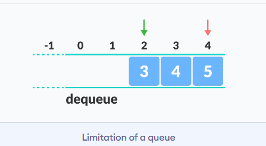
可以发现，经过若干入队，出队操作后，指针向右移动，而左面的空间无法使用（除非队列清空了，指针重置）。这个问题可以通过循环队列解决。

**复杂度**
使用数组的队列中入队和出队操作的复杂度为O(1)。

# PQ(Priority Queue) with an interlude on heaps
优先队列和普通队列操作类似，只是每个元素都有一个优先级，优先级高的元素先出队。
那么如何保证每次出队时都能选中优先级高的元素？每次出队时进行一次排序？
不，那样太低效率了。优先级队列通过堆(heap)实现。
堆是一种树型结构，可以分为小根堆和大根堆。小根堆具有一种属性：父节点<=子节点。 类似地，可以定义大根堆。

## PQ应用
- Dijkstra最短路径
- 任何你需要动态获得最好/最差 元素的情形
- Huffman 编码
- BFS(Best First Search)

## Turning Min-PQ into Max-PQ
由于大多数编程语言的标准库只提供min-PQ， 但是有时候我们需要max-PQ。

negate：对元素取负号 或者对比较器取反。
## 实现PQ
虽然PQ作为一种抽象数据结构，可以使用任何东西实现（比如列表）。但通常使用堆可以获得最佳的时间复杂度。
堆有很多，为了简单我们用二叉堆。
关于堆的前置知识：
二叉堆是满足堆性质的二叉树。
**complete binary tree 完全二叉树**：除最后一层节点外，其他层节点都是满的，并且最后一层节点都要左排列。


实现完全二叉树可以使用数组，并且有一个简单的访问子节点方法：如果父节点索引为i，那么子节点索引为2i+1, 2i+2。

二叉堆的插入，在堆的末尾插入，需要向上冒泡保持堆性质。
二叉堆的删除根，需要将根和末尾元素交换，然后从根向下冒泡。
二叉堆的删除普通节点，需要搜索出节点位置，然后和末尾元素交换，然后向上（或向下）冒泡以满足堆性质。

改进删除操作的时间复杂度到 O(log(n))？
使用哈希表(Hashtable)，将值和索引关联。
这样会额外引入两个问题，
1. 加入存在多个相同值的元素（例如有3个2），需要用set等存储索引。
2. 元素冒泡、删除、添加等操作时，索引也要相应的改变。


# Union Find(Disjoint Set)
Union Find是一种数据结构，追踪多个不相交集合中的元素
主要有两个操作 find 和 union。

**应用**
- Kruskal 最小生成树
- 网格渗透 Grid percolation
- 网络连接性
- 树中最不常见祖先
- 图像处理

## Kruskal 最小生成树
问题描述：
给定图G=(V,E)， 想要获得图的最小生成树。图的最小生成树是图的边的子集，连接所有顶点且边代价最小。
可以想象成一个修路问题，想要这些村庄（顶点）相互连接，并且修路成本（边的成本）最低。


Kruskal算法最小生成树算法步骤：
1. 将边按边的权重降序
2. 遍历排序后的边，如果边的两个顶点在同一个组中，则忽略这条边（因为这会导致环），否则我们包含这条边，并且合并两个顶点。
3. 重复2，直到每条边都处理过或者每个顶点都在一个组中。

## Union Find Operations
step1:将元素映射到数组索引，如E->0 A->1 ...
(方便后面使用数组存储union信息)
step2:Union 合并


总结：
find: 想要找到一个元素属于哪个组，需要一直找它的父节点，知道到达根节点（根节点的parent指向自身）
union: 想要合并两个元素，我们需要找到两个元素所属的根节点，然后将一个根节点作为另一个根节点的parent。

## Path Compression 路径压缩


源码：见最上方的仓库地址。

# Binary Trees anb Binary Search Trees(BST)

**树**

树是一种非线性层次结构。由相互连接的节点组成。

二叉树(Binary Tree)是每个节点最多有两个孩子的树。
二叉搜索树(Binary Search Tree)是满足 左子树<节点<右子树 的二叉树。（是否可以取等号取决于具体应用）

**BST的用处**
- 实现map 或 set
- 红黑树
- AVL
- 二叉堆
- 语法树
  


## 树的术语
**节点Node**
节点包含键或值以及指向其子节点的指针。每个路径的最后一个节点（没有子节点）称为叶节点(leaf node)。

**边 Edge**
它是任意两个节点之间的链接。


**根Root**
树的最顶层节点
**节点高度**
节点的高度是从节点到最深叶（即从节点到叶节点的最长路径）的边数。
**节点深度**
节点的深度是从根到节点的边数。
**树的高度**
树的高度是根节点的高度或最深节点的深度。
**节点的度数(Degree)**
节点的度数是该节点的分支总数。
**森林**
不相交的树的集合称为森林。

## BST则增删、查找
BST的插入、删除、移除、搜索的平均时间复杂度是对O(log(N))，但最坏情况的复杂度是O(N)。

**插入 Insert  into a BST**
插入元素时，我们考虑下面四种情况

`< case`:  recurse down left subtree
`> case`:  recurse down right subtree
`=case`: handle  duplicate value
`find a null leaf`: create a new node

在最坏情况下(1,2,3,4,5)，插入的时间复杂度是O(N)

**删除 remove**
删除元素 可以分为两部：1.查找 2.用后续节点替换
2 steps:
1. find
2. replace it with its successor to maintain BST invariant.

**查找**
查找的方式如下：
1. 如果到达null node， 说明元素不存在
2. 节点 ==元素 ： 找到！
3.   元素 < 节点：继续查找左子树
4.   元素 > 节点：继续查找右子树


叶子节点：可以直接移除
只有单个子树（只有左/右子树）：用后继节点替代。
有左右子树：用后继节点替代。 后继节点可以是左子树的最大或右子树的最小，它们都能满足BST性质。

## 树的遍历(Traversal)

根据访问根的顺序，可以分成
中序(inorder)遍历（左根右）、
前序(preorder)遍历（根左右）、
后序(postorder)遍历（左右根）

中序遍历(inorder)
```py
inorder(node):
    if node == None:return
    inorder(node.left)
    print(node.value)  
    inorder(node.right)
```
前序遍历 preorder
```py
preorder(node):
    if node == None:return
    print(node.value)
    preorder(node.left)
    preorder(node.right)
```
后序遍历 psotorder
```py
postorder(node):
    if node == None:return
    postorder(node.left)
    postorder(node.right)
    print(node.value) 
```

还有一种层序遍历(level order)，逐层访问,广度优先。
可以用队列实现。

# HashTable
哈希表以键-值(Key-value)的形式存储数据
Key是索引，Value则是数据。
哈希表通过hashing 建立从key到value的映射。
实际上，哈希表是一种数组(index-value)。


## 直接寻址表
如果key很少的话，可以用直接寻址。可以用一个数组，或称为直接寻址表，记作T[0..m-1]。其中每个位置，或称为槽，对应key域的一个key。

容易实现字典操作：
```
DIRECT-ADDRESS-SEARCHCT,k) 
return T[k]
DIRECT-ADDRESS-INSERT(T,x) 
T[x.,key]=x 
DIRECT-ADDRESS-DELETE(T,x) 
T[x. key]=NIL 
```

## 哈希 hashing
key通常并不直接作为数组索引，需要进行一个映射。
哈希是将key映射成索引的过程:
`index = h(key)`  

因此，知道了key，就可以直接获得索引，而无需遍历查找。
通过key获得value的效率是`O(1)`。（一般情况下）
此外，key可以是任意类型，不一定是整数，也可以是字符串，自定义的类，只要实现相应的hash函数就行。

**哈希函数的性质**
如果H(x) == H(y) ，那么x可能和y相等。（哈希冲突）
如果H(x) ！= H(y) ，那么x一定和y不同。

对于同一个x, H(x) 是确定的。（因此，很多语言要求key是不可变的）

可以利用hash函数加速对象比较。
如果我们计算了file1和file2的哈希值，那么就可以直接比较这两个值，而不需要打开文件并比较内容。（设计合适的hash函数几乎可以避免哈希冲突。

## 哈希冲突
对于不同的key,哈希函数映射到同一个索引，则发生冲突。
即x,y是两个不同对象，但H(x)==H(y)
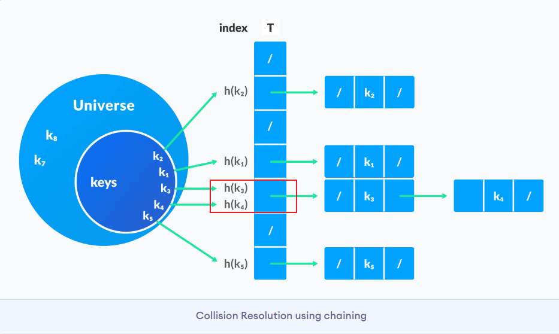
(尽管可以通过下面的方法解决哈希冲突的存储问题，但是为了保持哈希表的时间复杂度，应该避免哈希冲突。
最根本的是维持哈希表的大小超过元素数量。当哈希表满的时候，我们要创建一个更大的哈希表。)
## (分离)链接法 separate chaining
我们可以通过链表解决哈希冲突。此时槽中存储的是一个链表。 


解决冲突后，容易实现字典操作：
```
chainedHashSearch(T, k)
  search for an element with k in list T[h(k)]
chainedHashInsert(T, x)
  insert x at the head of T[h(x.key)] 
chainedHashDelete(T, x)
  delete x from the list T[h(x.key)]
```

## 开放寻址 Open Addressing
开放寻址法将所有元素存放在散列表中。要查找元素时，需要系统检查所有的表项。
开放寻址法的好处就在于它不用指针，而是计算出要存取的槽序列。于是，不用存储指针而节省的空间，使得可以用同样的空间来提供更多的槽，潜在地减少了冲突，提高了检索速度。


**I. 线性检测(Linear probing)**
在线性探测中，通过检查下一个插槽来解决冲突。 
`h(k, i) = (h′(k) + i) mod m `
其中，
`i = {0, 1, …,m-1}`
`h'(k)`是新的哈希函数
如果在`h(k, 0)`发生碰撞，则检查`h(k, 1)`。 这样，i的值线性增加。 线性探测的问题是相邻槽的簇被填充。 插入新元素时，必须遍历整个集群。 这增加了对哈希表执行操作所需的时间。
```py
HASH-INSERT(T,k) 
1   i=O 
2   repeat 
3     j=h(k,i) 
4     if T[j]==NIL 
5       T[j]=k 
6       return j 
7     else i=i+l 
8   until i==m 
9   error "hash table overflow" 
```
查找关键字k的算法的探查序列与将K插入时的算法一样。因此，查找过程中碰到一个空槽时，查找算法就（非成功地）停止，因为如果k在表中，它就应该在此处，而不会在探查序列随后的位置上（之所以这样说，是假定了关键字不会从散列表中删除）。过程HASH-SEARCH的输入为一个散列表T和一个关键字k,如果槽j中包含了关键字k,则返回j;如果k不在表T中，则返回NIL。
```
HASH-SEARCH(T,k) 
1 i=O 
2 repeat 
3   j=h(k,j) 
4   if T[j]==k 
5     return j 
6   i=i+1 
7 until T[j]==NIL or i==m 
8 return NIL 
```

开放寻址法的散列表中删除操作元素比较困难。当我们从槽i中删除关键字时，不能仅将NIL置于其中来标识它为空。如果这样做，就会有问题：在插入关键字K时，发现槽i被占用了，则K就被插入到后面的位置上；此时将槽i中的关键字删除后，就无法检索到关键字K了。
有一个解决办法，就是在槽i中置一个特定的值DELETED替代NIL来标记该槽。这样就要对过程HASH-INSERT做相应的修改，将这样的一个槽当做空槽，使得在此仍然可以插入新的关键字。对HASH-SEARCH无需做什么改动，因为它在搜索时会绕过DELETED标识。但是，当我们使用特殊的值DELETED时，查找时间就不再依赖于装载因子a了。为此，在必须删除关键字的应用中，更常见的做法是采用链接法来解决冲突。。

(探测函数的一个问题是 循环，如果GCD(a,N) != 1，那么多次哈希冲突后，探测函数能找到的位置就会陷入循环。线性函数选择a=1, p(x)=x ，可以对任意N成立GCD(a,N)=1，避免循环)
**II. 二次探测 Quadrabic**
在二次探测中，通过使用以下关系，可以增大槽之间的间距（大于 1）。 
$h(k, i) = (h′(k) + c_1 i + c_2 i^2) mod m$
其中，
c_1和c_2是正的常数，
i = {0, 1, …m-1}

同样，二次探测也要考虑避免循环。
一种方法是，让P(x) = (x^2 + 2)/2， table size N = 2的幂。
**III.双重哈希(double hashing)** 
`h(k, i) = (h_1(k) + i h_2(k)) mod m`
其中h_1和h_2都是辅助散列函数 。 初始探查位置为 T[h_1 (k)], 后续的探查位置是前一个位置加上偏移量h_2(k)后模m。因此，不像线性探查或二次探查，这里的探查序列以两种不同方式依赖于关键字k,因为初始探查位置、偏移量或者二者都可能发生变化。


## 常见的hash函数
良好的哈希函数具有以下特征。

它不应生成太大且存储桶空间小的键。 空间被浪费了。
生成的键的范围不能太近，也不能太远。
必须尽可能减少碰撞。
用于散列的一些方法是：

**取余**
如果k是键，并且m是哈希表的大小，则哈希函数h()的计算公式为：
h(k) = k mod m

**乘法**
h(k) = ⌊m(kA mod 1)⌋ 其中，

kA mod 1给出小数部分kA，
⌊ ⌋给出底值
A是任何常数。A的值在 0 到 1 之间。但是，最佳选择是 Knuth 建议的≈ (√5-1)/2。
**通用哈希**
在通用哈希中，哈希函数是独立于键随机选择的。


## **哈希表应用**

- 需要常数时间的查找和插入
- 密码学应用
- 需要索引数据


# Fenwick Tree(Binary Indexed Tree)
motivation： 前缀和存在的问题，如果某个元素改变了，后续前缀和都需要重新计算。

Fenwick Tree：是一种支持范围查询和更新的数据结构。

**range queries**
索引从1开始， 使用二进制表示，最低有效位(least significant bit, LSB)决定负责的范围。 例如1 为 00001 ,负责的范围是2^0=1（负责自身）。 2是00010，负责的范围是2^1=2（即负责2和1位置）。 4是00100，负责的范围是2^2=4

代码
```
function prefixSum(i):
    sum := 0
    while i!= 0 :
        sum  = sum + tree[i]
        i = i - LSB(i)
    return sum

function rangeQuery(i, j):
    return prefixSum(j) - prefixSum(i-1)

LSB return the value of the least significant bit. e.g. LSB(12) = 4 because 12 = 1100_2, the least significant bit is 100_2 , is 4 in base ten.
```

这个过程就像是不断删除最低位的1。

**Fenwick Tree Point Updatas**
节点i 变为i+x。
```
function add(i, x):
    while i < N:
        tree[i] = tree[i] + x
        i = i + LSB(i)  
```

更新过程就像是不断增加最低位的1。

**Fenwick Tree Point Construction**
从数组构建Fenwick Tree.
```
function construct(values):
    N := length(values)
    tree = deepCopy(values)

    for i = 1,2,3,...N:
        j := i + LSB(i)
        if j < N:
            tree[j] = tree[j] + tree[i]
        
    return tree

```

# Suffix Arrays
6:14:50 


———————— 
————————
————————

## 2.3 Types of Queue
有4种不同的队列：
- Simple Queue
- Circular Queue
- Priority Queue
- Double Ended Queue
- Minimum Spanning Tree(MST),最小生成树


**简单队列**， 遵循先进先出规则。


**循环队列**，最后一个元素指向第一个元素


**优先级队列**，插入时根据值的到达发生，而删除根据优先级发生
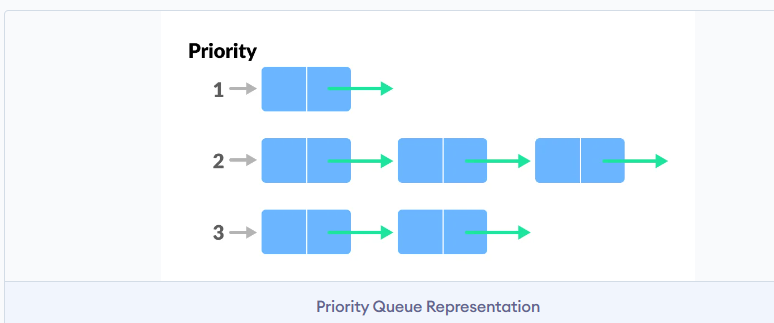

**双端队列**，两头都可以插入或删除，它不遵循先进先出。
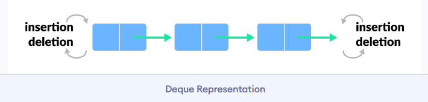

## 2.4 Circular Queue
循环队列是普通队列的一个扩展，它将最后元素和第一个元素连接起来，构成循环。解决了普通队列的空间浪费的问题。
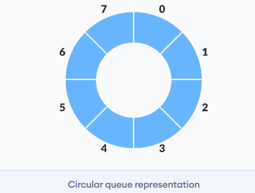

**如何实现循环？**
通过指针的**循环加**实现，也就是说，如果指针到达队列的末尾，就会从头开始(通过取余实现)。
`if REAR + 1 == 8 (overflow!), REAR = (REAR + 1)%8 = 0 (start of queue)`

**循环队列的操作**
首先，它满足普通队列的操作。
使用两个指针`FRONT`和`REAR`分布追踪队列开头和结尾元素。指针初始值为`-1`。
Enqueue：
- 检查是否已满
- 如果是第一个元素，`FRONT`设为0.
- 循环加`REAR`索引
- 将新元素放到`REAR`位置

Dequeue：
- 检查是否为空
- 返回`FRONT`位置元素
- 循环加`FRONT`
- 如果是最后一个元素，重置`FRONT`和`REAR`为-1

然而，检查队列满需要考虑新的情况：
- case 1: FRONT == 0 && REAR == SIZE - 1
- case 2: FRONT == REAR + 1

这两种情况可以合并为：
`(REAR+1)% SIZE == FRONT`
第二种情况发生在REAR由于循环加而从 0 开始且其值仅比FRONT小 1 时，队列已满。


**循环队列的Python实现**
```py
class MyCircularQueue:
    def __init__(self, size):
        self.size = size
        self.queue = [None] * size
        self.head = self.tail = -1

    def is_empty(self):
        return self.head == -1

    def is_full(self):
        return (self.tail + 1) % self.size == self.head

    # Insert an element into the circular queue
    def enqueue(self, data):
        if self.is_full():
            print("The circular queue is full\n")
            return None
        if self.head == -1:
            self.head = 0
        self.tail = (self.tail + 1) % self.size
        self.queue[self.tail] = data

    # Delete an element from the circular queue
    def dequeue(self):
        if self.is_empty():
            print("The circular queue is empty\n")
            return None

        temp = self.queue[self.head]
        if self.head == self.tail:
            self.head = -1
            self.tail = -1
        else:
            self.head = (self.head + 1) % self.size
        return temp

    def __str__(self):
        if self.head == -1:
            return "No element in the circular queue"
        elif self.tail >= self.head:
            return str(self.queue[self.head: self.tail + 1])
        else:
            return str(self.queue[self.head: self.size] + self.queue[:self.tail + 1])
```

**测试：**
https://leetcode.cn/problems/design-circular-queue/
注：需要根据题目要求做一些修改。
**时间复杂度**
出队入队为O(1)
**循环队列应用**
- CPU 调度
- 内存管理
- 交通管理

### 循环队列要点小结
1. 通过循环加(`rear = (rear + 1)%size`) 实现循环
2. 通过front == -1 判断空
3. 通过(rear + 1)%size == front 判断满
4. 判断入队和出队时的特殊情况：队列变空/非空


## 2.5 Priority Queue
优先级队列出队顺序和元素的优先级相关，而不是先进先出。
通常使用二叉堆(heap)实现优先队列。下面用最大堆（父>子）实现。
（这个实际上主要讲了堆操作，如何实现可以等到看到堆的时候再回头看）
优先级队列的**插入元素**：
1.将元素**插入树的底部**
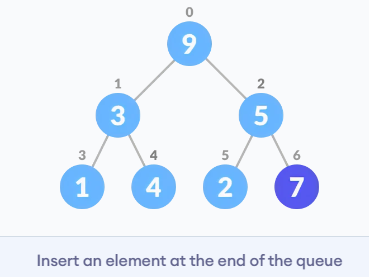
2.Heapify


**删除元素**
1.选择要删除的元素(3)

2.与树的底部元素交换
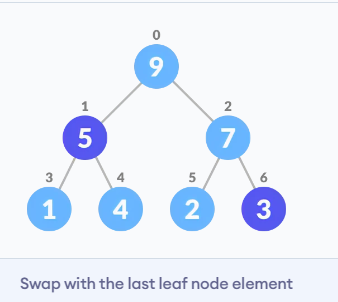
3.删除元素
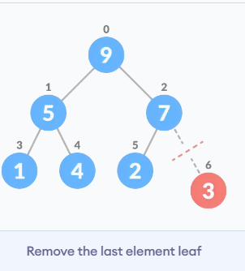
4.Heapify
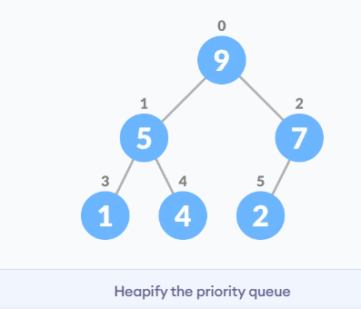

**Peek**
返回根节点
**提取最大/小值**
从最大堆中删除节点后，Extract-Max返回具有最大值的节点，而从最小堆中删除节点后，Extract-Min返回具有最小值的节点。

优先队列Python实现
```py
# Priority Queue implementation in Python


# Function to heapify the tree
def heapify(arr, n, i):
    # Find the largest among root, left child and right child
    largest = i
    l = 2 * i + 1
    r = 2 * i + 2

    if l < n and arr[i] < arr[l]:
        largest = l

    if r < n and arr[largest] < arr[r]:
        largest = r

    # Swap and continue heapifying if root is not largest
    if largest != i:
        arr[i], arr[largest] = arr[largest], arr[i]
        heapify(arr, n, largest)


# Function to insert an element into the tree
def insert(array, newNum):
    size = len(array)
    if size == 0:
        array.append(newNum)
    else:
        array.append(newNum)
        for i in range((size // 2) - 1, -1, -1):
            heapify(array, size, i)


# Function to delete an element from the tree
def deleteNode(array, num):
    size = len(array)
    i = 0
    for i in range(0, size):
        if num == array[i]:
            break

    array[i], array[size - 1] = array[size - 1], array[i]

    array.remove(size - 1)

    for i in range((len(array) // 2) - 1, -1, -1):
        heapify(array, len(array), i)


arr = []

insert(arr, 3)
insert(arr, 4)
insert(arr, 9)
insert(arr, 5)
insert(arr, 2)

print ("Max-Heap array: " + str(arr))

deleteNode(arr, 4)
print("After deleting an element: " + str(arr))
```
Python的库实现：https://docs.python.org/zh-cn/3/library/queue.html?highlight=queue#queue.PriorityQueue

**优先队列应用**
- Dijkstra 算法
- 用于实现栈
- 用于操作系统中的负载平衡和中断处理
- 用于霍夫曼代码中的数据压缩


## 2.6 Deque
(这个部分programiz.com上感觉有点问题，建议直接看LeetCode上的循环双端队列题解)
双端队列是队列的一种，其中元素的插入和删除可以从前面或后面进行。 因此，它不遵循 FIFO 规则（先进先出）。
### 双端循环队列小结
- 使用front和rear指针指向队列头和尾。初始化front = -1, rear = -1
- 判空用front == -1。 判满有2种情况：1. front在最左，rear在最右；2.  front在rear右一格： `front == 0 and rear == n - 1 OR front == rear + 1`
- 插入前都要判满，删除前都要判空
- 插入时考虑特殊情况，队列为空时，插入一个元素将导致`front=rear=0`。
- 使用循环-和循环+ 左右移动指针。例如插入时：front和rear:`self.front = (self.front-1) % self.size` 、`self.rear = (self.rear+1)%self.size` 插入时front向左，删除时front向右。
- 删除时考虑只有一个元素时，删除将清空队列。
下面是用循环数组实现的双端队列
操作：
**初始化**
**在前面插入**
**在尾部插入**
**从前面删除** 
**从后面删除**
**Check Empty**
If front == -1, the deque is empty.
**Check Full**
If front == 0 and rear == n - 1 OR front == rear + 1, the deque is full.

Python实现Dequeue(简单版)
```py
# Deque implementaion in python

class Deque:
    def __init__(self):
        self.items = []

    def isEmpty(self):
        return self.items == []

    def addRear(self, item):
        self.items.append(item)

    def addFront(self, item):
        self.items.insert(0, item)

    def removeFront(self):
        return self.items.pop(0)

    def removeRear(self):
        return self.items.pop()

    def size(self):
        return len(self.items)


d = Deque()
print(d.isEmpty())
d.addRear(8)
d.addRear(5)
d.addFront(7)
d.addFront(10)
print(d.size())
print(d.isEmpty())
d.addRear(11)
print(d.removeRear())
print(d.removeFront())
d.addFront(55)
d.addRear(45)
print(d.items)
```

数组实现双端循环队列Dequeue：
```py
class MyCircularDeque:
    def __init__(self, size):
        self.size = size
        self.items = [-1] * size
        self.front = -1
        self.rear = -1

    def isFull(self):
        return (self.front == 0 and self.rear == self.size - 1) or (self.front == self.rear + 1)

    def isEmpty(self):
        return self.front == -1

    def insertFront(self, item):
        if self.isFull():
            return False
        if self.isEmpty():
            self.front = self.rear = 0
        else:
            self.front = (self.front-1) % self.size
        self.items[self.front] = item
        return True

    def insertLast(self, item):
        if self.isFull():
            return False
        if self.isEmpty():
            self.front = self.rear = 0
        else:
            self.rear = (self.rear+1)%self.size
        self.items[self.rear] = item
        return True

    def deleteFront(self):
        if self.isEmpty():
            return False
        if self.front == self.rear:
            self.front = self.rear = -1
        else:
            self.front = (self.front+1)% self.size
        return True

    def  deleteLast(self):
        if self.isEmpty():
            return False
        if self.front == self.rear:
            self.front = self.rear = -1
        else:
            self.rear = (self.rear-1)%self.size
        return True

    def getFront(self):
        if self.isEmpty():
            return -1
        return self.items[self.front]

    def getRear(self):
        if self.isEmpty() or self.rear < 0:
            return -1
        return self.items[self.rear]

```

**应用**
- 软件中的撤销操作(undo)
- 浏览器历史记录
- 实现stack和queue。

