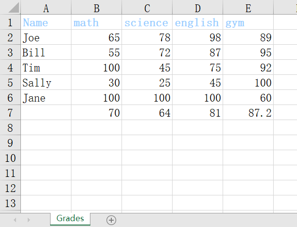
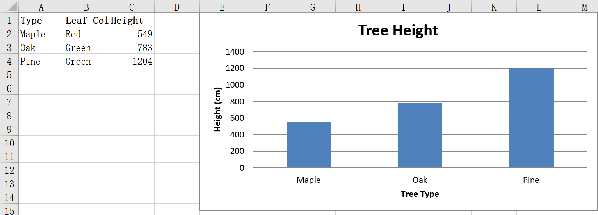

# 安装
openpyxl 是一个 Python 库，用于读/写 Excel 2010 xlsx/xlsm/xltx/xltm 文件。此外，也可以把文件保存成流在Flask或Django等web应用程序使用。

使用pip安装：
`pip install openpyxl`


>文档：https://openpyxl.readthedocs.io/en/stable/tutorial.html
中文文档（较长时间未更新）https://openpyxl-chinese-docs.readthedocs.io/zh_CN/latest/tutorial.html

详细的使用可以参考文档，下面是两个简单示例。

# 例1 统计平均分
将成绩数据写入xlsx，并统计平均分。
```py
from openpyxl import Workbook, load_workbook
from openpyxl.utils import get_column_letter
from openpyxl.styles import Font

data = {
	"Joe": {
		"math": 65,
		"science": 78,
		"english": 98,
		"gym": 89
	},
	"Bill": {
		"math": 55,
		"science": 72,
		"english": 87,
		"gym": 95
	},
	"Tim": {
		"math": 100,
		"science": 45,
		"english": 75,
		"gym": 92
	},
	"Sally": {
		"math": 30,
		"science": 25,
		"english": 45,
		"gym": 100
	},
	"Jane": {
		"math": 100,
		"science": 100,
		"english": 100,
		"gym": 60
	}
}

wb = Workbook() # 创建表格 
ws = wb.active # 获取工作簿(worksheet) 
ws.title = "Grades"

headings = ['Name'] + list(data['Joe'].keys())
ws.append(headings)

for person in data:
	grades = list(data[person].values())
	ws.append([person] + grades)

for col in range(2, len(data['Joe']) + 2):
	char = get_column_letter(col)
	ws[char + "7"] = f"=SUM({char + '2'}:{char + '6'})/{len(data)}"

for col in range(1, 6):
	ws[get_column_letter(col) + '1'].font = Font(bold=True, color="0099CCFF")

wb.save("NewGrades.xlsx")
```
>代码来自https://github.com/techwithtim/ExcelPythonTutorial
# 例2 绘制图表
官方文档的一个示例。

```py
from openpyxl import Workbook


wb = Workbook()
ws = wb.active
treeData = [["Type", "Leaf Color", "Height"], ["Maple", "Red", 549],
            ["Oak", "Green", 783], ["Pine", "Green", 1204]]

# 将数据追加写入wb
for row in treeData:
    ws.append(row)

# 改变字体
from openpyxl.styles import Font
ft = Font(bold=True)
for row in ws["A1:C1"]:
    for cell in row:
        cell.font = ft

# 绘制图表 BarChart()
from openpyxl.chart import BarChart, Series, Reference
chart = BarChart()
chart.type = "col"
chart.title = "Tree Height"
chart.y_axis.title = 'Height (cm)'
chart.x_axis.title = 'Tree Type'
chart.legend = None
data = Reference(ws, min_col=3, min_row=2, max_row=4, max_col=3)
categories = Reference(ws, min_col=1, min_row=2, max_row=4, max_col=1)
chart.add_data(data)
chart.set_categories(categories)
ws.add_chart(chart, "E1")
wb.save("TreeData.xlsx")
```
